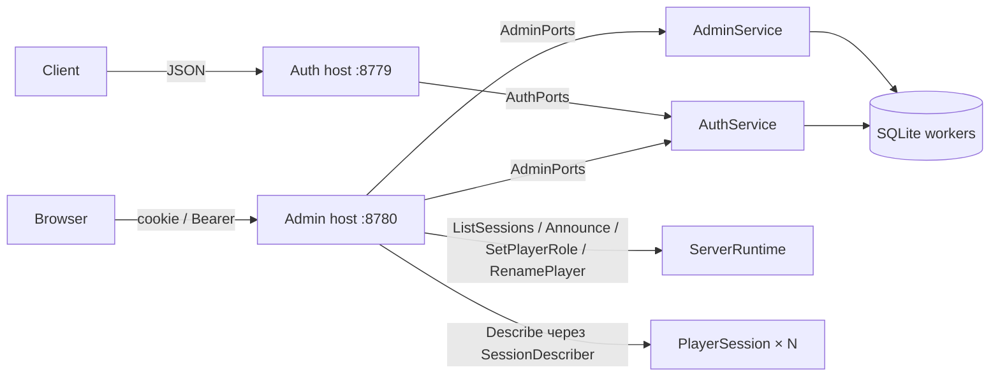

# Веб-админка сервера

Статус на 30.09.2026: реализована в процессе игрового сервера. Проект
`src/Dreamsleeve.Server.Web` — общая HTTP-обвязка, публичные маршруты `/auth/*` и панель на
Falco + Falco.Markup + htmx (SSR, без собственного JavaScript). `Dreamsleeve.Server` остаётся
composition root: поднимает оба хоста и связывает их порты с агентами.

## Назначение и границы

Панель — окно администратора в работающий сервер ([ProductSpecRu.MD §16](ProductSpecRu.MD),
[TechnicalHandbookRu.MD §13](TechnicalHandbookRu.MD)): состояние сервера и онлайн, поиск
игроков, роль, переименование display name, сброс пароля и отзыв доступа, объявления, аудит,
токены REST API и конфигурация только на чтение.

Панель не источник бизнес-логики (§15.5). Каждое действие идёт через владельца, у которого
правило уже есть:

| Действие | Владелец |
|---|---|
| Сброс пароля, отзыв доступа | `AuthService`: `CreatePasswordReset` / `RevokeAccount`, как консольные команды |
| Переименование | `AuthService.RenamePlayer` (SQLite), затем runtime → `PlayerSession` → presence |
| Роль | `AdminService` (SQLite + аудит), затем runtime → живая `PlayerSession` |
| Объявление | `ServerRuntimeMessage.Announce` → владелец системного канала, как `announce <текст>` |
| Онлайн | `ServerRuntimeMessage.ListSessions` + `PlayerSessionMessage.Describe` |
| Администраторы, сессии, токены, аудит, поиск | `AdminService` (bounded workers `admin-storage`) |

Отдельного процесса, `admin.proto` и IPC нет. Прямых запросов к SQLite из HTTP-обработчиков
нет: хранилище вызывают только workers агентов.



Обработчики зависят от записей функций (`AuthPorts`, `AdminPorts`), а не от агентов;
`WebPorts` в `Dreamsleeve.Server` подключает агенты. Поэтому HTTP-тесты работают с фейковыми
портами без ENet и SQLite.

## Первичная настройка

1. Запустите сервер. Пока администраторов нет, в консоль (не в лог) печатается строка
   `Admin panel setup code (one-time, 15 min; open /setup of the panel): <код>`.
2. Откройте `http://127.0.0.1:8780/setup`, введите код, имя администратора и пароль дважды.
   Первый администратор создаётся вместе со строкой аудита `created_admin` и сразу входит.
3. Новый код — команда консоли `admin-setup` (прежний код при этом перестаёт действовать).
   Когда администратор уже есть, команда отвечает, что настройка завершена.

Забытый пароль: `admin-reset <имя>` печатает код, страница `/reset` принимает код и новый пароль.
Все прежние сессии этого администратора закрываются, пишется `reset_admin_password`.

Коды — 32 случайных байта, живут `CodeLifetimeMinutes`, хранятся только в памяти
`AdminService` (SHA-256) и в БД не пишутся. Код одноразовый: его тратит первая попытка, в том
числе неудачная. Выпуск нового кода того же назначения заменяет предыдущий. Перезапуск сервера
забывает все коды.

Имя администратора подчиняется правилам `Username` игроков, пароль — тому же правилу 12–128 байт
UTF-8 и тому же `PasswordHasher` с `PasswordIterations` из `[Authentication.Service]`.
Администраторы хранятся отдельно (`admin_accounts`): администратор не обязан быть игроком, а
игровой аккаунт не даёт доступа к панели.

## Конфигурация

```toml
[Admin]
Enabled = true
ListenUrl = "http://127.0.0.1:8780"
AllowInsecureLoopback = true
AllowInsecureRemote = false      # пароль без TLS только явно, как у аутентификации
CertificatePath = ""             # прямой HTTPS без обратного прокси
TrustForwardedHeaders = false    # true только за прокси на loopback
SessionHours = 12
CodeLifetimeMinutes = 15
LoginAttemptsPerMinute = 10      # на адрес клиента и на имя администратора
RequestsPerMinute = 600          # остальные запросы на адрес клиента
MaxConnections = 64
RequestTimeoutSeconds = 15
```

Старый `server.toml` без `[Admin]` получает эти значения. Проверки при запуске (только при
`Enabled = true`): абсолютный URL только со схемой, хостом и портом; HTTP вне буквального
loopback — только с `AllowInsecureRemote`; порт панели не совпадает с портом аутентификации;
лимиты в допустимых диапазонах. Пароль сертификата — переменная окружения
`DREAMSLEEVE_ADMIN_CERTIFICATE_PASSWORD` (у аутентификации — `DREAMSLEEVE_AUTH_CERTIFICATE_PASSWORD`).
`[Authentication]` получила тот же ключ `TrustForwardedHeaders = false`.

`Enabled = false` не запускает ни хост панели, ни `AdminService`; консольные `admin-setup` и
`admin-reset` тогда отвечают, что панель выключена.

Доменные настройки, которые когда-нибудь будут меняться из панели, должны жить в БД
([TechnicalHandbookRu.MD §9.5](TechnicalHandbookRu.MD)). Сейчас `server.toml` и
`moderation.toml` читаются при запуске; страница «Конфигурация» показывает действующие значения
(`Configuration.render`) и текст словаря только на чтение.

## Роли

`PlayerRole = Player | Moderator` (0/1) хранится в `player_roles` только для зарегистрированного
игрока (`PlayerRole.assign`, внешний ключ на `profiles`). Роль читается вместе с профилем при
входе и resume, попадает в билет и после погашения — в `PlayerSession`. Смена в панели пишет
строку и аудит, затем `ServerRuntimeMessage.SetPlayerRole` доставляет `RoleChanged` живой сессии
без переподключения. Runtime запоминает изменения с момента старта (`SessionTable.Roles`) и
передаёт их сессии сразу после резерва PlayerId: сессия, чей билет выдан до смены, всё равно
получает новую роль.

Пока роль ничего не разрешает: в игровой протокол она не выносится, полномочия модератора
появятся вместе с задачей модерации (баны, муты). Панель показывает роль в карточке, в онлайне
и в REST.

## Переименование

Меняется только display name. Панель проверяет `DisplayName.create` с лимитом
`[Server.ChatInput] DisplayName` и серверный словарь (`Moderation.allows`); уникальности у
display name нет по домену (уникален только username). `AuthService.RenamePlayer` выполняется
исключительно (как отзыв) и обновляет ещё не погашенные билеты этого игрока. Затем
`ServerRuntimeMessage.RenamePlayer` → `PlayerSession.ProfileChanged`: сессия применяет
`Moderation.publicProfile`, обновляет книгу имён (`SessionHostCommand.UpdateProfile`) и отправляет
presence-обновление; остальные получают `PlayerUpdated` тем же путём, что при смене псевдонима
(`identityEqual`). У скрытого игрока публичная личность — псевдоним, поэтому новое настоящее имя
к другим игрокам не уходит. Новые сообщения чата несут новое имя; метки на земле без
псевдонима покажут его после переподключения автора (`GroundMarksAgent` берёт профиль из подписки).

## Страницы

| Путь | Что делает |
|---|---|
| `/setup`, `/reset`, `/login`, `POST /logout` | Первичная настройка, смена пароля по коду, вход, выход |
| `/` | `ServerRuntimeSnapshot` и таблица онлайна; htmx обновляет её раз в 5 с (`/partials/online`) |
| `/players?q=&page=` | Поиск по username, display name (подстрока, `%` и `_` буквальные) или точному PlayerId; страницы по 50 |
| `/players/{id}` | Карточка: профиль из БД, роль, живые сессии; формы роли, переименования, сброса пароля (код показывается один раз), отзыва доступа |
| `/announce` | Текст (лимит `MessageText`) и вид `admin`/`announcement`/`event`; `periodic` принадлежит расписанию |
| `/audit` | Последние 200 строк |
| `/tokens` | Создание (токен показывается один раз) и отзыв токенов REST |
| `/config` | Действующие настройки и словарь, только чтение |

Опасные действия требуют отмеченного флажка подтверждения (сервер проверяет `confirm=yes`) и
пишут строку `admin_audit`. Таблица онлайна показывает настоящие username, display name и имя
персонажа скрытого игрока вместе с псевдонимом (`~Страж`) и вариантом режима — см.
[ModerationAndNamesRu.md](ModerationAndNamesRu.md#скрытое-имя), абзац «Админка.». Эти данные
собирает только `AdminPlayerView.create` и только для панели; игровые пакеты их не несут.
Сессия, не ответившая за 1 с, показывается строкой «нет данных», страница не падает.

## REST API

Только чтение, те же модели, что у страниц, JSON с camelCase и `null` для неизвестного:

| Маршрут | Ответ |
|---|---|
| `GET /api/v1/status` | `{connections, ready, reservations, closing, stopping}` |
| `GET /api/v1/online` | Массив строк онлайна (настоящие имена, `pseudonym`, `hidden`, `role`, `phase`, `connectedAt`, `described`) |
| `GET /api/v1/players?page=&q=` | `{query, page, pageSize, total, players[]}` |
| `GET /api/v1/players/{id}` | `{player, sessions[]}` |

Доступ — cookie панели или `Authorization: Bearer <token>`. Токены создаются на странице
«Токены API»; в БД — SHA-256 и метка (1–64 символа). Ошибки — тот же `{code, message}`, что у
auth: `unauthorized` (401), `not_found` (404), `rate_limited` (429), `busy`/`unavailable` (503).

## Хостинг

По умолчанию панель слушает только `127.0.0.1:8780`. Варианты удалённого доступа:

- SSH-туннель без изменения конфигурации: `ssh -L 8780:127.0.0.1:8780 user@server`, затем
  `http://127.0.0.1:8780` у себя.
- Обратный прокси с HTTPS на той же машине. Панель остаётся на loopback, в `[Admin]` —
  `TrustForwardedHeaders = true`. Заголовки `X-Forwarded-For`/`X-Forwarded-Proto` принимаются
  только от `127.0.0.1`/`::1` и только один переход (`ForwardLimit = 1`). Прокси обязан передать
  исходный `Host`: проверка `Origin` сравнивает его со `схемой://Host` запроса.

```nginx
server {
    listen 443 ssl;
    server_name admin.example.org;
    ssl_certificate     /etc/ssl/admin.pem;
    ssl_certificate_key /etc/ssl/admin.key;
    location / {
        proxy_pass http://127.0.0.1:8780;
        proxy_set_header Host $host;
        proxy_set_header X-Forwarded-For $remote_addr;
        proxy_set_header X-Forwarded-Proto $scheme;
    }
}
```

```caddy
admin.example.org {
    reverse_proxy 127.0.0.1:8780
}
```

Caddy передаёт `Host` и `X-Forwarded-*` по умолчанию. Прямой HTTPS без прокси:
`ListenUrl = "https://0.0.0.0:8443"`, `CertificatePath` и пароль в переменной окружения.
HTTP наружу без TLS — только явным `AllowInsecureRemote = true` (пароль и cookie идут открыто).

## Безопасность

- Сессия панели — cookie `dreamsleeve_admin` со случайным 32-байтовым токеном; в
  `admin_sessions` только SHA-256. `HttpOnly`, `SameSite=Strict`, `Path=/`, срок `SessionHours`;
  `Secure`, когда запрос пришёл по HTTPS (прямо или по доверенному `X-Forwarded-Proto`).
- Каждый `POST` принимается только при `Origin`, равном источнику панели, или, если браузер
  `Origin` не прислал либо прислал `null`, при `Sec-Fetch-Site: same-origin`; иначе 403 до любой
  работы. `Origin: null` — нормальный случай: при `Referrer-Policy: no-referrer` браузер так
  сериализует источник своих же форм (спецификация Fetch), а `Sec-Fetch-Site` ставит сам браузер.
- Лимиты: вход/настройка/сброс — `LoginAttemptsPerMinute` на адрес клиента (HTTP rate limiter) и
  на имя администратора (`AdminService`); остальное — `RequestsPerMinute` на адрес. Без
  `TrustForwardedHeaders` адрес — это адрес сокета, `X-Forwarded-For` игнорируется.
- Заголовки: `Content-Security-Policy: default-src 'self'; frame-ancestors 'none'; form-action 'self';
  base-uri 'none'`, `X-Content-Type-Options: nosniff`, `Referrer-Policy: no-referrer`,
  `X-Frame-Options: DENY`, `Cache-Control: no-store` (статика — `max-age=3600`). Inline-скриптов
  и стилей нет; htmx настроен meta `htmx-config` с `allowEval: false`, `allowScriptTags: false`,
  `includeIndicatorStyles: false`, `historyCacheSize: 0`.
- Разметка: весь текст через `Text.enc` Falco.Markup. Falco.Markup не кодирует значения
  атрибутов, поэтому `AdminViews` строит атрибуты одним помощником, который их кодирует, и не
  использует `Text.raw` и текстовые сокращения (`Text.h1` и т. п.), где значение не кодируется.
- htmx 2.0.11 (0BSD) лежит в `Resources/htmx.min.js` и встроен в сборку вместе с лицензией;
  CDN нет. Целостность пакета сверена с `integrity` npm-реестра при вендоринге.
- В лог не попадают пароли, коды, токены и cookie. Лог получает имя администратора и действие
  (`Admin root: set_role player:42 moderator`); коды печатаются только в консоль.

## Хранение

Миграция `1790812800000_admin.sql`, `PRAGMA user_version = 5`, с DOWN-секцией:
`admin_accounts`, `admin_sessions`, `admin_api_tokens`, `player_roles`, `admin_audit`
(время — Unix-миллисекунды UTC). Подробности — [db/README.md](../db/README.md).

## Не в этой версии

Баны и муты, правка лимитов и словаря из панели, гильдии и партии, аналитика, несколько ролей
администраторов (все администраторы равны), удаление администратора из панели.

## Проверки

Managed (Expecto): домен (роли, ключи аудита, коды и сессии, `AdminPlayerView` показанного и
скрытого игрока), SQLite (миграция 5 поверх 4 и DOWN, уникальность, сроки сессий, токены, роль
только для существующего профиля и её чтение при входе, поиск с `%` и `_`, пагинация, аудит,
переименование), `AdminService` (одноразовость, замена и срок кода, лимит попыток входа, сброс
пароля закрывает сессии, `Busy`, токены), runtime (`ListSessions`, `Describe`, роль вживую и для
сессии, открывшейся позже, переименование доходит до других, у скрытого — не утекает), HTTP
(`/setup` без кода/с чужим кодом/повторно, флаги cookie, 403 без `Origin`, `Sec-Fetch-Site`,
REST без токена и с ним, объявление с видом и аудитом, кодирование текста, CSP, лимит входа и
`X-Forwarded-*` только при доверии), конфигурация (`[Admin]` по умолчанию, старый файл, отказ на
удалённый HTTP и совпадение портов, пример). Переписанный auth проходит прежние проверки без
изменения ожиданий.
