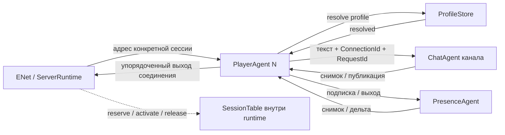

# План разделения SessionRegistry

Статус: исходный согласованный план, сохранён для истории решений. Шаги 1–6 реализованы;
сетевой запуск и измерения завершаются отдельными шагами. Текущая архитектура описана
в [Core README](../src/Dreamsleeve.Server.Core/README.ru.md), ход проверок —
в [журнале реализации](SessionRefactorProgressRu.md). Разделы 1–15 ниже сохраняют
формулировки и имена на момент планирования; соответствие итогов приведено в разделе 16.
Основа: коммит `f4eef57` (`ChatFlow pre refactor commit`), 27 сентября 2026 года.
Задача: убрать общий прикладной маршрутизатор, сохранить корректность сессий и дать независимым владельцам работать параллельно.

## 1. Рекомендуемое решение

Для текущего одного сетевого владельца отдельный агент SessionRegistry не нужен.
Нужны таблицы привязок и резервов, которыми может владеть ServerRuntime.
Оформляем их обычным модулем SessionTable: закрытые Dictionary, именованные функции, один владелец, без прикладных lock.
ServerRuntime ещё предстоит реализовать; это целевая архитектура, а не описание работающего сервера.

Оставляем одного персонального агента на сессию, развивая существующий PlayerAgent.
Он владеет Domain.Player, открытием/закрытием, персональным допуском команд и своим исходящим потоком.
Второй агент SessionAgent рядом с ним сейчас не вводится: времена жизни совпадают.
ChatAgent получает полноценное владение публикацией, общий онлайн выделяется в PresenceAgent.
Чат, изменения игрока и будущие команды групп не проходят через общий каталог сессий.

Для первого завершённого варианта выбирается путь `Runtime → PlayerAgent конкретной сессии → ChatAgent`.
Персональный агент хранит только свои незавершённые RequestId и квоту; канал создаёт сообщение, принимает его и рассылает.
Это осознанный локальный переход: сохраняется предел запросов клиента без общего счётчика или новой системы кредитов.
Прямой `Runtime → ChatAgent` допустим, но имеет отдельную цену допуска, разобранную в разделе 5.

Агент кеша, глобальная шина событий, универсальный роутер и slot map на этом этапе не добавляются.

## 2. Что обнаружено в текущем коде

| Участок | Что сосредоточено сейчас | Последствие |
|---|---|---|
| SessionRegistry.State, openSession, playerStopped | Соединения, резервы PlayerId, создание и наблюдение игроков | Связанные обязанности жизненного цикла можно оставить у владельца runtime |
| sendChat, ChatPublication.State | Проверка сессии/канала, ID и время, общий pending, квоты | Чат выполняется частично вне своего владельца; подсчёт запросов игрока сканирует все публикации |
| publicationReply, broadcast | Выбор получателей и рассылка | Все публикации будущих каналов снова попадут в один последовательный обработчик |
| online, joined, left | Онлайн, начальный снимок, события присутствия | Общий порядок обеспечивается связью с единственным каналом |
| UpdatePlayer, ReadPlayer | Пересылка уже адресованной игроку команды и ответа | Дополнительный общий переход для независимых игроков |
| ChatAgent.Publish | Принимает уже собранный ChatMessage | Вызывающий хранит и сверяет ожидаемое сообщение; канал почти не владеет публикацией |
| ChannelOutcome | Joined/Left/Published/History в одном ответе | Получатель проверяет, что пришёл вариант, соответствующий отправленной команде |

Вынос ChatPublication в файл изменил организацию исходников, но не владельца состояния.

Параллелизм не отсутствует полностью: каждый Agent читает свою очередь последовательно, разные агенты работают через ThreadPool независимо.
Текущий реестр не ждёт профильную БД или допуск в чужую очередь внутри обработчика: используются отдельные outbox.
Тем не менее публикации, их результаты и fanout выполняются через один mailbox реестра. Это архитектурная точка общей сериализации.
Измерений throughput пока нет; называть её доказанным пределом производительности преждевременно.

Основания: исходники `src/Dreamsleeve.Server.Core/SessionRegistry.fs`,
`ChatPublication.fs`, `ChatAgent.fs`, `PlayerAgent.fs` в baseline `f4eef57`.
Например: `git show f4eef57:src/Dreamsleeve.Server.Core/SessionRegistry.fs`.
Библиотечная основа: [Agent](../src/Dreamsleeve.Agent/Agent.fs) и
[AgentOutbox](../src/Dreamsleeve.Agent/AgentOutbox.fs).

## 3. Владельцы после разделения

| Владелец | Его состояние и решения | Что через него не проходит |
|---|---|---|
| ServerRuntime | ENet host/peers, маршруты ConnectionId, короткие операции SessionTable, допуск соединений, доставка пакетов, наблюдение завершения сессий | Правила чата, история, создание ChatMessage, изменения Domain.Player, правила гильдий |
| SessionTable, модуль внутри runtime | ConnectionId → адрес/фаза; PlayerId → резервирующий ConnectionId | Выполнение прикладных запросов; живые словари наружу не выдаются |
| PlayerAgent, один на сессию | Domain.Player, resolve профиля, открытие, bootstrap, персональные ожидания, последовательный выход и закрытие | Другие игроки, общий онлайн, история канала, MessageId |
| ChatAgent, один на канал | Участники и адреса сессий, создание сообщения, порядок, история, публикации | Поиск в реестре при каждом сообщении, ENet peer, игровые данные игрока |
| PresenceAgent | Активные профили и подписки на онлайн; снимок и дельты | Чат, поток движения, универсальный каталог всех сущностей |
| MemoryProfileStore / будущий DB adapter | Постоянная личность и профиль, асинхронный контракт хранения | Маршруты живых соединений |

PresenceAgent оправдан собственным набором изменяемых данных и правилом «снимок + последующие изменения».
Онлайн внутри таблицы маршрутов снова заставит сетевой runtime строить снимки и выполнять O(N) рассылки присутствия.
Обновления мира позднее адресуются владельцам областей/сущностей; они не должны расширять PresenceAgent до потока всех показаний.



На схеме один PlayerAgent показан для читаемости. У остальных свои mailbox, ожидания и выходы.
Публикация адресуется каждому подписчику непосредственно по сохранённому адресу сессии.

## 4. Каталог, кеш, словарь и хендлы

| Вариант | Оценка |
|---|---|
| Dictionary под владением одного runtime | Рекомендуется: lookup там, где уже получен пакет; дополнительного mailbox нет |
| Отдельный SessionDirectory agent | При нескольких владельцах транспорта/регистрации. Только reserve/resolve/release, без горячего пути команд |
| CacheAgent перед каталогом | Не нужен: ещё одна очередь и протокол инвалидирования той же информации |
| Локальная таблица готовых адресов | Рекомендуется: актуальный маршрут соединения, а не кеш Domain.Player с TTL |
| ConcurrentDictionary для всех агентов | Не нужен при одном владельце; не делает атомарной всю последовательность reserve/close/release |
| Slot map / массив по peer slot | Последующая оптимизация по измерениям. Обязателен generation; номер peer переиспользуется |

В таблице минимальны ConnectionId, адрес агента, состояние допуска, зарезервированный PlayerId и состояние очистки.
Копий положения, Actor Values, истории и состава гильдий здесь нет.
Допустимые стадии выражаются DU; независимые Connected/Stopped/Announced/Leaving механически не переносятся.
Стадия транспорта в runtime и стадия работы PlayerAgent имеют разные назначения и согласуются конкретными сообщениями.

Существующий новый Guid ConnectionId на соединение уже отличает поколения peer.
PlayerId — постоянная личность; ConnectionId — экземпляр соединения; RequestId — клиентский запрос.
Снятие подписки и адресованные события сохраняют ConnectionId. Поздний Close/Leave/ответ не действует на нового владельца PlayerId.
ActorRef ограничивает адрес жизнью агента, но сам по себе не подтверждает членство в канале.

Запрос к агенту внутри процесса допустим для актуального снимка/редкого поиска. Это постановка в очередь и ответ, а не обычное чтение Dictionary.
Проблема запроса перед каждым пакетом — общая зависимость и гонка устаревшего ответа, а не заранее известная «медленность F#».
Маршрут выдаётся при открытии, используется напрямую и инвалидируется при завершении.

При нескольких ENet hosts нельзя копировать право уникального reserve в независимые словари.
Тогда нужен общий владелец резервов или определённое разбиение по PlayerId; локальные маршруты пакетов остаются у каждого runtime.

## 5. Как идут команды

### Открытие

1. Runtime назначает ConnectionId. Первый допустимый OpenSession создаёт PlayerAgent; повторный Open на этом соединении отклоняется.
2. PlayerAgent асинхронно запрашивает профиль. Runtime обслуживает остальные соединения.
3. Получив профиль, игрок отправляет TryReserve(ConnectionId, PlayerId, replyTo) владельцу SessionTable.
4. В одном проходе проверяются актуальность открывающегося соединения и отсутствие чужого резерва. Ответ: Reserved / AlreadyInUse / ConnectionClosed.
5. При успехе игрок подписывается на канал и онлайн, собирает начальные данные.
6. В свой единый исходящий поток помещает Activate(ConnectionId, SessionOpened), затем накопленные события.
7. Runtime принимает Activate только для актуального открывающегося соединения с соответствующим резервом. В этом же шаге ставит SessionOpened первым в выход соединения и разрешает обычные входящие команды.

Готовность не определяется одной доставкой профиля или ENet Connected. Политика входа не зависит от наличия БД.

Полный дедлайн прикладного открытия принадлежит runtime: от подключения до обработанного Activate, включая ожидание первого OpenSession, профиля и снимков. По истечении runtime закрывает маршрут и запускает обычную процедуру остановки/очистки. Игрок не заводит второй таймер на тот же вход; транспортные таймауты ENet решают отдельную задачу. Ограниченный bootstrap buffer не заменяет дедлайн: живой источник может вообще не прислать снимок.

### Чат: первый вариант

```text
runtime: decode → адрес сессии
PlayerAgent: ready? есть квота? → зарегистрировать свой RequestId
PlayerAgent → ChatAgent: Publish(ConnectionId, RequestId, validatedText, replyTo)
ChatAgent: участник? допустима публикация? → ID/время → append → публикация
ChatAgent → PlayerAgent автора: сообщение + корреляция
ChatAgent → PlayerAgent остальных: то же сообщение
PlayerAgent → runtime: исходящий ChatResponse
```

PlayerAgent не составляет ChatMessage и не сверяет его с сохранённой копией.
Его pending содержит только сведения о собственных запросах для допуска/завершения. Глобальный ChatPublication удаляется.
Канал берёт автора из серверного членства, созданного Join. Внутренний ChatAccepted может остаться вариантом с обязательным RequestId; на wire автор тоже получает ChatPublished.
Повтор команды с RequestId не превращается автоматически в поддержку exactly-once/retry.

Изменения игрока идут `runtime → PlayerAgent → Domain.Player`, чтения — этому же агенту.
Посредничество общего реестра исчезает. Внешнее чтение использует существующий контракт ответа/отмены библиотеки.

### Альтернатива: runtime отправляет чат прямо каналу

После готовности runtime может хранить узкий адрес чата с привязанным ConnectionId.
Канал проверяет членство и выполняет Publish без обращения к каталогу.

Но MaxPendingPerPlayer ограничивает уже допущенные, ещё незавершённые запросы клиента.
Bounded mailbox канала даёт общий предел очереди, не персональную квоту.
Прямой путь требует переноса учёта в runtime, квотируемого входа с возвратом разрешений либо явной смены политики на ограничение частоты/очереди.
Первые варианты добавляют механизмы, последний меняет гарантию и тесты.

Поэтому прямой путь не является условием удаления Registry. Первый вариант использует существующего персонального владельца, сохраняет квоты и не сериализует разных игроков.
После измерений прямой путь можно ввести отдельно, сохранив контракт Publish и выдачу событий сессиям.

## 6. Что получает ChatAgent

Контракт меняется с «сохранить составленный другим компонентом ChatMessage» на «принять текст от участника».

- JoinAndSubscribe: доверенные ConnectionId/PlayerData и узкий адрес событий сессии.
- Publish: ConnectionId, обязательный RequestId, валидированный текст и узкий replyTo, привязанный отправляющим PlayerAgent к своей сессии. ChannelId определяется адресатом или проверяется при выборе адреса канала.
- Detach: конкретный ConnectionId; повтор безопасен.
- ReadHistory: типизированный результат страницы, без произвольного ChannelOutcome.

replyTo нужен и при отсутствии членства: отказ NotMember должен завершить запрос игрока, даже когда записи подписчика в канале уже нет. Адрес задаётся серверным кодом, а не wire-пакетом.
Успешный ответ автору содержит опубликованное сообщение и одновременно завершает запрос; второй экземпляр рассылки ему не посылается.

Канал создаёт MessageId и время при принятии, хранит сообщение и публикует всем, включая автора.
Предлагается зафиксировать идентичность сообщения как (ChannelId, MessageId), выдавать возрастающие ID у владельца канала.
Текущие wire-контракты и отдельные клиентские ChatCache не требуют глобального порядка между каналами. Агент-счётчик не вводится.
Если понадобится глобальная уникальность ID, это отдельное изменение контракта.
UTC-время остаётся миллисекундным; порядок задаётся ID, а не часами.

Domain.Chat владеет историей и её инвариантами. Адреса сессий остаются в Core.
Обновление доменного членства и сетевой привязки выполняется одним обработчиком ChatAgent.
Профиль участника — доверенное неизменяемое значение для авторства, не копия изменяемого Player.

Перезапуск канала не объявляется прозрачным. Сброс истории/счётчика требует новой сессии/канала у действующих клиентов по определённому протоколу.
При будущем восстановлении истории ID продолжаются выше сохранённого максимума; epoch/resume определяются отдельно.

## 7. Начальный снимок без общего реестра

Главный риск — потеря события между чтением снимка и подпиской либо отправка дельты раньше SessionOpened.
Последовательность «прочитать snapshot, потом Subscribe» недопустима.

Каждый источник делает snapshot + subscription в одном своём обработчике:

1. ChatAgent устанавливает участника/подписчика и формирует ChatSnapshot. Снимок — первое сообщение источника данной сессии, следующие публикации идут после него.
2. PresenceAgent аналогично активирует присутствие и выдаёт OnlineSnapshot, включающий self, вместе с подпиской на следующие изменения.
3. PlayerAgent собирает оба снимка, сохраняя уже приходящие дельты в ограниченном буфере открытия.
4. Через один исходящий поток отправляет Activate с SessionOpened, затем буфер, затем обычные события.

Снимок и дельты источника используют один последовательный путь доставки. Независимые фоновые отправки могут поменять порядок.
При TryPost из последовательного обработчика порядок успешных постановок сохраняется; Full прекращает подписку, а не молча пропускает событие.
Переполнение буфера открытия закрывает только эту сессию и запускает снятие подписок.

Глобальная транзакция между онлайном и историей не нужна. Требуется согласованный срез каждого источника и доставка всех его следующих изменений.
В ChatMessage есть профиль автора, который может быть офлайн. Поэтому сообщение допустимо до PlayerJoined или после PlayerLeft из независимого потока присутствия.
Это осознанное ослабление нынешнего общего порядка разных подсистем. Порядок сообщений канала и порядок онлайна сохраняются отдельно.

После активации Presence, но до доставки welcome соединение может закрыться. Это компенсируется удалением присутствия; доставка welcome клиенту не является транзакцией активации.
Новые wire revisions не обязательны. Внутренние номера операций нужны только там, где реально различаются повторные запросы/подписки.

## 8. Disconnect, сбой и уведомление заинтересованных владельцев

Runtime знает об отключении раньше остальных. Он немедленно запрещает новые команды и отправку пакетов этому ConnectionId.
Известные заинтересованные владельцы могут получить уведомление сразу; рассылка всем агентам приложения не нужна.
Отключение снимает сетевые подписки и временное присутствие. Оно не означает выход из постоянной гильдии или удаление профиля.

Закрытие маршрута и освобождение PlayerId — разные события. Запланированный Stop/Detach ещё не означает завершённую очистку.
Запись Closing и резерв сохраняются до остановки старого агента и подтверждённой очистки его членств/подписок.

Штатное закрытие:

1. Runtime закрывает маршрут и отправляет Stop персональному агенту.
2. Игрок прекращает новый допуск, завершает/отменяет ожидания, согласует незавершённые Join и отправляет Detach источникам.
3. Detach подписки идёт после её ранее запланированных команд по упорядоченному пути; канал отвечает после применения.
4. После требуемой очистки игрок завершает работу. Runtime наблюдает фактический Completion и освобождает резерв, проверив владельца ConnectionId.

Авария игрока:

1. Runtime закрывает маршрут и наблюдает Completion, включая завершение фоновых отправок.
2. После этой границы новая отложенная отправка Join от старого игрока не появится. Уже поставленные команды ещё могут находиться у адресатов.
3. Владелец жизненного цикла отправляет идемпотентный DropSession(ConnectionId) всем известным возможным владельцам подписок и получает подтверждения очистки.
4. Затем освобождает резерв. Остановленный источник считается очищенным, когда его экземпляр действительно завершён и не продолжит обработку.

Слепой broadcast Disconnect недостаточен: DropSession может обработаться раньше запоздалого Join и оставить «призрачного» участника.
Уникальный ConnectionId не решает перестановку команд сам по себе.

Сейчас зависимости фиксированы сборкой: store, Presence и глобальный Chat; очищать сетевое членство нужно в Presence/Chat.
Для будущего динамического вступления сначала нужно получить подтверждение регистрации интереса к завершению у владельца жизни и только затем отправлять Join. Две независимые отправки без этого подтверждения не дают нужного порядка.
Список описывает адресатов очистки и не превращает runtime в обработчик правил групп. Универсальный event bus не нужен.

По дедлайну закрытия допускается Abort с ожиданием cleanup. Нельзя снять резерв по таймеру, пока старые отправки/членство могут продолжаться.
Если общая зависимость не даёт завершить очистку, политика останавливает/пересоздаёт соответствующую область обслуживания; безопасный вход не достигается игнорированием старого состояния.
Уже принятое каналом сообщение сохраняется в истории и у остальных. Ответ отключённому ConnectionId отбрасывается на сетевой границе.

При остановке всего runtime сначала запрещаются новые входы и пользовательские команды. Runtime продолжает читать служебные сообщения и дренировать либо отбрасывать выход закрытых соединений, пока завершаются игроки и их очистка. Chat/Presence остаются живыми до окончания Detach. Только затем закрываются источники и сам сетевой владелец. Нельзя вызвать Complete его mailbox и после этого ждать ребёнка, которому ещё нужен ответ на cleanup. Профильный store можно сохранить между штатными перезапусками сети.

## 9. Очереди, перегрузка и границы библиотеки

Каждая очередь получает предел и политику переполнения. Отсутствие прикладных lock не означает отсутствие синхронизации внутри mailbox.

| Граница | Политика |
|---|---|
| Пакеты → сессия | Неблокирующий допуск; отклонение команды/закрытие перегруженного соединения. ENet owner не ждёт чужой mailbox |
| Квота публикаций сессии | Персональный предел незавершённых RequestId; Overloaded до передачи новой публикации каналу |
| Сессия → канал | Ограниченная очередь; Full/отказ допуска даёт отказ запроса до изменения истории |
| Канал/Presence → сессия | Последовательный неблокирующий fanout. Full/Closed снимает только этого подписчика; Full закрывает отставшую сессию |
| Буфер bootstrap | Ограничение количества/объёма; переполнение завершает открывающуюся сессию |
| Сессия → сеть | Ограниченный порядок по соединению, включая welcome. Медленный peer не задерживает остальных |
| Служебные сообщения | Ограниченный путь Stop/Detach/cleanup, который нельзя исчерпать только пользовательскими Publish |

Начальный fanout — TryPost каждому подписчику в его non-dropping mailbox без фонового ожидания.
Это политика отключения отставшего. Reliable-сообщение не теряется молча при сохранённой рабочей сессии.
При Full источник убирает подписчика из рассылки и отправляет SlowConsumer(ConnectionId) runtime через отдельный ограниченный служебный маршрут. Нельзя отправлять требование Close по той же заполненной очереди данных сессии. Runtime закрывает маршрут/peer и запускает остановку и очистку. Уведомление планируется один раз для удалённой подписки; отказ общего управляющего выхода становится наблюдаемым сбоем зависимости.
Если позже понадобится сглаживать всплески дополнительным outbox на подписчика, нужны отдельная отмена маршрута и общий бюджет.
Текущий AgentOutbox по умолчанию останавливает владельца при закрытии адресата; для рассылки всем участникам это непригодно.
AgentReplyDispatcher с независимыми отправками тоже не обеспечивает FIFO событий подписчика.

Минимальное полезное расширение библиотеки — TryPost у ReliableAgentRef с исходами Posted/Full/Closed.
Сейчас TryPost есть у AgentRef, ReliableAgentRef предоставляет только PostAsync. Non-dropping проверяется при сборке адреса.
Own, Watch, PipeToSelf, AgentReplyScope и bounded outbox для запросов/служебных событий уже есть; повторять их в приложении не нужно.

Отдельно нужно обеспечить резерв служебного допуска. У нынешнего mailbox одна общая ёмкость; сумма лимитов outbox не резервирует место внутри mailbox адресата.
Целевой контракт: пользовательские команды не занимают служебный резерв, уже допущенные команды сохраняют порядок.
Если существующие API этого не обеспечивают, добавить в библиотеку ограничение обычного допуска с резервом в той же FIFO, а не серверный lock или приоритетный обход очереди.
Пределы проверяются на границе очереди атомарно; QueueLength перед TryPost не является резервированием.
Резерв необходим и на отправляющей стороне: при M ожидающих публикациях outbox сессии оставляет дополнительные места для Join/Detach/служебного завершения. Закрытие сначала прекращает обычный допуск, затем ставит Detach в ту же FIFO; отдельный обходной outbox не должен обгонять уже запланированный Publish или Join.
Расширение начинается с теста, где заполнены одновременно обычный вход канала и исходящая очередь сессии, а Detach всё равно допускается после предыдущих команд. Новая система кредитов между всеми агентами не требуется.

У сетевого выхода нужны пределы пакетов/байтов по соединению и общий бюджет, согласованные с MaxPacketBytes/MaxWaitingData.
ENet, служебные сообщения и исходящие пакеты обрабатываются с бюджетами за проход, чтобы данные не вытесняли Disconnect/Stop.
Доставка в mailbox, принятие каналом и получение клиентом — разные события. Сбой выхода после append не откатывает историю.

Настройки необходимо разделить по реальному смыслу, а не сохранить старые имена с новой семантикой:

| Сейчас | После разделения |
|---|---|
| MaxPendingPerPlayer используется для нескольких разных очередей | Отдельные пределы запросов чата сессии, чтений и доставок |
| MaxPendingChatRequests считает ожидания общего реестра | Ёмкость обычного входа канала плюс персональные квоты; это другие границы, общего pending больше нет |
| MaxPendingChannelRequests | Служебный резерв и ограниченные операции членства, привязанные к сессиям |
| MaxPendingOutput общего реестра | Выход/буфер каждой сессии и общий сетевой бюджет |
| MaxPendingReplies единственного выхода ChatAgent | Лимиты адресных событий/подписчиков и политика Full; прежний общий выход удалён |

Общая верхняя граница памяти учитывает MaxSessions × персональные лимиты, очереди источников и байтовый бюджет сети. Наличие отдельных bounded mailbox само по себе не ограничивает число ожидающих фоновых писателей.

## 10. Проверки: что остаётся и что исчезает

| Проверка | Подходящее место |
|---|---|
| Формат protobuf, версия, ненулевые wire ID, создание доменного текста | Codec/входная граница |
| Уникальный PlayerId, актуальный ConnectionId при reserve/release | SessionTable у runtime |
| Ready/Closing, собственный запрос, персональная квота | PlayerAgent; runtime дополнительно закрывает транспортный маршрут |
| Членство конкретной сессии и принятие публикации | ChatAgent |
| Порядок/ограничение истории | Domain.Chat у ChatAgent |
| Актуальность адресата исходящего пакета | Runtime перед использованием peer |
| Ёмкость, settlement запросов, остановка фоновой работы | Библиотека Agent и политика владельца |

Исчезают проверки «Published вернул ровно ранее составленный ChatMessage» и ожидания всех публикаций в общем реестре.
Типизированные результаты Join/History/Publish убирают ручное отвержение чужих вариантов универсального ответа.
Корреляция асинхронных операций, защита от старого соединения и ограничения памяти остаются.
Проверка строки не повторяется каждым агентом после построения валидированного доменного типа.

## 11. Параллелизм и его пределы

Состояние разных игроков меняется независимо, их чтения не занимают общий registry mailbox.
Разные каналы имеют разных владельцев. Задержка сессии/источника не останавливает независящих от неё владельцев.
Общие резервы затрагиваются при входе/выходе и редком разрешении адреса, а не при каждой публикации/телеметрии.

Один канал последовательно определяет порядок своей истории; его рассылка требует работы по числу участников.
Один ENet host имеет одного владельца; декодирование/передача пакетов и lookup не становятся параллельными от переименования типов.
Когда они окажутся пределом, нужно измерить. Последующее разбиение — несколько hosts/каналов/областей мира, а не parallel_for по разделяемым Dictionary.

Агент не равен выделенному потоку. Библиотека использует Task.Run/ThreadPool и выполняет один обработчик данного агента за раз.
Текущий outbox также запускает отслеживаемую фоновую Task на каждую допущенную отправку.
Число пересылок/выделений памяти важно; добавление агентов само по себе не ускоряет работу.
Неблокирующий fanout и устранение общего кругового маршрута полезнее преждевременного slot map.

## 12. Раскладка проектов и файлов

Имена новых файлов предварительные; важны владельцы и направление зависимостей.

| Место | Изменение |
|---|---|
| Server.Core/SessionContracts.fs | Узкие контракты личности/маршрута, управления входом и выхода; без ENet peer и изменяемого Player |
| Server.Core/SessionTable.fs | Закрытые словари и reserve/activate/beginClose/release; собственного Agent нет |
| Server.Core/PlayerAgent.fs | Персональное открытие/закрытие, bootstrap и квоты; один агент, без второго слоя того же времени жизни |
| Server.Core/ChatAgent.fs | Намерение, адреса участников, ID/время, снимок/подписка, самостоятельная публикация |
| Server.Core/PresenceAgent.fs | Общий онлайн и упорядоченная подписка со снимком |
| Server.Core/ServerRuntime.fs | Таблица/жизненный цикл, диспетчеризация адресованных команд и выход; без peer в контрактах |
| Server.Infrastructure | MemoryProfileStore остаётся; ENet adapter добавляется на сетевом этапе. Кеш живых сессий не добавляется |
| Server/Program.fs | Сборка зависимостей и запуск вместо Hello from F# |
| SessionRegistry.fs / ChatPublication.fs | Удалить после переноса поведения и тестов; второго пути выполнения не оставлять |

Core и adapter не должны стать двумя глобальными роутерами каждого пакета.
ServerRuntime — логика единственного владельца сети; adapter использует её в том же контуре владения.
Именованные обработчики и run loop сохраняются. Общие интерфейсы на каждый модуль не нужны.
Конкретный цикл yENet и адаптер проверяются на сетевом этапе по установленной библиотеке.

## 13. Последовательность изменений

Каждый пункт оставляет собираемый репозиторий и понятный отдельный diff. Сначала проверяемые контракты владельцев, затем сборка взаимодействия.
Изменение ChannelRequest/результатов/start выполняется вместе с изменением всех вызывающих мест и тестов. Если для небольшого переходного коммита необходим адаптер старой сборки, он только переводит сообщения и удаляется в шаге 6; старый и новый пути не могут одновременно владеть одним членством или исполнять одну команду.

### Шаг 1. Инварианты и узкие контракты

- Зафиксировать ConnectionId как идентичность экземпляра, владение PlayerId-резервом и стадии закрытия.
- Описать снимок/дельты, адресованный выход и намерение публикации; wire-протокол без необходимости не менять.
- Разделить существующие проверки на доменные гарантии и детали старого Registry.
- Добавить сценарии новых рисков: независимые источники bootstrap, запоздалый Join после Disconnect, заполненный получатель.

Готовность: сформулированы наблюдаемые гарантии и намеренные изменения — отсутствие общего порядка разных источников и внешней выдачи MessageId.

### Шаг 2. Допуск и доставка независимым владельцам

- Добавить неблокирующий reliable admission, сохранив проверку mailbox policy при сборке адреса.
- Проверить служебный резерв на насыщенном входе; при необходимости реализовать минимальный механизм в библиотеке с одной FIFO.
- Определить ограниченный fanout и адресованное завершение медленного подписчика.

Готовность: Full одного получателя не блокирует других; Stop/Detach не теряются за пользовательским потоком; нет unbounded фоновых PostAsync.

### Шаг 3. Публикация у канала

- Изменить Join/Publish на серверный контекст участника и команду-намерение.
- Перенести ID/время, ChatMessage и получателей в ChatAgent.
- Сделать snapshot+subscription атомарной операцией с упорядоченными событиями на адрес сессии.
- Удалить сравнение результата с ранее собранным сообщением и глобальное назначение ID.

Готовность: ChatAgentTests проверяют полный путь без SessionRegistry; автор получает ту же публикацию; независимые каналы работают отдельно.

### Шаг 4. PresenceAgent и персональный bootstrap

- Перенести онлайн в самостоятельного владельца снимка/дельт.
- Расширить существующий PlayerAgent сборкой обоих снимков и ограниченным буфером открытия.
- Перенести персональную квоту и завершение RequestId; ответы чата идут сессиям напрямую.
- Ввести единый исходящий порядок Activate → события.

Готовность: история/онлайн могут отвечать в разном порядке, но клиент сначала получает SessionOpened; на границе подписки нет потерь.

### Шаг 5. SessionTable и жизненный цикл

- Реализовать словари одного владельца и короткие переходы reserve/activate/close/release.
- Перенести создание/наблюдение PlayerAgent к владельцу runtime.
- Направить игровые команды/чтения непосредственно игроку; общий реестр исключить из пути чата.
- Реализовать штатную очистку и аварийный барьер Completion → DropSession → освобождение резерва.

Готовность: одновременный вход одного PlayerId допускает одного владельца; Disconnect в любой стадии и падение агента не оставляют членство и не повреждают новое соединение.

### Шаг 6. Удаление прежней сборки и перенос сценарных тестов

- Registry/ChatFlow-сценарии перевести на реальные новые владельцы и runtime без ENet.
- Удалить SessionRegistry, ChatPublication и старые универсальные ChannelOutcome-пути без применения.
- Обновить Core README, CurrentState, Protocol README и настройки.

Готовность: общего обработчика публикаций/телеметрии больше нет; используется одна сборка, сохранены значимые сценарии.
Тест «канал вернул не то заранее составленное сообщение» заменяется проверками нового контракта; исчезнувшая архитектура ради теста не поддерживается.

### Шаг 7. Настоящий серверный ENet runtime

- Заменить Program-заглушку сборкой зависимостей; подключить MemoryProfileStore через Infrastructure.
- Один владелец host ведёт peer → ConnectionId; после decode отправляет команды выбранному владельцу без ожидания доменного ответа.
- Подключить адресованные пакеты, лимиты, бюджеты за проход, Disconnect, Completion и дедлайны остановки.
- Согласовать готовность и первый SessionOpened; исключить двойную диспетчеризацию через глобальные агенты.

Готовность: два Client.Dev входят, видят онлайн, работают чат/отключение/повторный вход.
Для сквозного чата понадобится отдельный небольшой клиентский шаг: сейчас C++ ClientRuntime не отправляет SendChat и отклоняет ChatAccepted как unsolicited.
Серверный рефакторинг не должен ошибочно объявляться уже работающим сквозным чатом.

### Шаг 8. Измерения и решение об оптимизациях

- Сравнить базовый коммит и новый путь на одинаковой машине/конфигурации.
- Измерить throughput, p50/p95/p99 допуска/принятия, задержку Disconnect, очереди, allocations/GC, ThreadPool queue и память.
- Сценарии: один канал с растущим числом участников; независимые каналы; медленный получатель; обновления разных игроков.
- По результатам решать о прямом Runtime → ChatAgent, пакетировании fanout, slot map, исполнителе outbox или нескольких hosts.

Готовность: сравнение воспроизводимо. Произвольный порог «быстрее X мс» в функциональном тесте не считается доказательством параллелизма.

## 14. Приёмочные сценарии

1. Две сессии одного PlayerId конкурируют за reserve; выигрывает одна независимо от Username.
2. Disconnect до/после profile reply, reserve, Join, snapshot и Activate не оставляет присутствие.
3. Старые Join/Publish/Detach/Close/ответ не меняют новую сессию после переиспользования peer slot.
4. Аварийная очистка после Completion удаляет Join, допущенный до сбоя, но обработанный позднее.
5. Публикация перед snapshot входит в историю, после него приходит дельтой ровно один раз.
6. Онлайн и чат отвечают в обратном порядке; ни одна дельта не выходит перед SessionOpened.
7. Автор отсутствует в онлайне, но его сохранённое сообщение корректно отображается.
8. Полный mailbox подписчика закрывает только его; здоровые получатели и другой канал продолжают работу.
9. Квота отправителя не расходует квоту другого; отклонённая до принятия команда не меняет историю.
10. Полные пользовательский вход и исходящая очередь сессии не лишают систему служебного допуска; Detach не обгоняет ранее запланированные команды.
11. Stop/Abort не зависят от доставки пакетов отключённому peer; ожидания чтений завершаются, служебный вход runtime остаётся доступным до очистки детей.
12. Задержанный PlayerAgent A не мешает чтению/изменениям B; задержанный канал A не мешает каналу B.
13. После выхода/аварии число подписок, резервов и работ возвращается к исходному; память ограничена ёмкостями.
14. Автор получает серверное сообщение без локального добавления и второго экземпляра рассылки.
15. Молчащий, но живой store/источник снимка завершает открытие по единственному application deadline; поздний Activate не оживляет закрытый маршрут.

Функциональные проверки синхронизируются gates с конечными ожиданиями; нагрузочные замеры идут отдельно.
Нынешние сценарии — источник требований, число тестов само по себе не критерий успеха.

## 15. Границы плана

Предлагается удалить общий Registry-agent, а не переименовать его в ServerRuntime или разбить на файлы.
Runtime остаётся владельцем транспорта и коротких переходов маршрутов. Предметные возможности получают своих владельцев и не добавляют туда автоматы выполнения.

Рефакторинг не включает настоящую авторизацию, БД, гильдии, игру, прозрачное восстановление и распределённые гарантии.
Он сохраняет места для расширения без временных тестовых сущностей и заранее придуманной иерархии менеджеров.
Начинать следует с шагов 1–3; весь жизненный цикл и ENet не смешивать с ними в один коммит.

## 16. Реализация и уточнения к исходному плану

| Решение плана | Итог реализации |
|---|---|
| Развить PlayerAgent, не создавать второго владельца сессии | Итоговый модуль называется `PlayerSession`; старый `PlayerAgent` удалён. Он владеет и Domain.Player, и bootstrap/RequestId/выходом |
| Агент канала | Итоговый модуль `ChatRoomAgent`; старые `ChatAgent`/`ChannelOutcome` удалены. Один экземпляр на канал назначает ID и время, хранит историю и адреса подписчиков |
| Каталог без отдельного агента | `SessionTable` — закрытые словари внутри ServerRuntime. Дополнительных cache/router agents и slot map нет |
| Отдельный онлайн | PresenceAgent владеет snapshot+дельтами. Общего порядка между разными источниками нет; PlayerSession ограниченно буферизует события до обоих снимков |
| Reliable TryPost и резерв | `AgentMailbox.boundedWithControl` с pure classifier, `ReliableAgentRef.TryPost`: Posted/Full/Closed. Одна FIFO, без приоритетного обгона; quota возвращается при dequeue, текущий handler сверх queued bound |
| Независимый fanout | Источник напрямую TryPost каждому подписчику. Full удаляет только подписчика; адресное SlowConsumer идёт через bounded control outbox. Pending PostAsync на каждого получателя нет |
| Служебная доставка | Ответ Detach подтверждает уже выполненное удаление. Full его получателя аварийно завершает источник; переполнение control outbox также наблюдаемо через Completion. Скрытой потери подтверждения нет |
| Аварийный DropSession | Используется идемпотентный Detach после фактического Completion ребёнка. Резерв удерживается до очистки обоих источников; поздняя команда старого ConnectionId не затрагивает новое соединение |
| Закрытие транспорта | Штатное закрытие позволяет ENet отправить уже принятый ответ. Маршрут учитывается до domain cleanup и Disconnected; deadline принудительно освобождает peer при готовой domain cleanup, иначе останавливает владельцев |
| Ограниченный сетевой выход | Помимо mailbox/outbox ограничиваются native ENet пакеты/байты на peer и host до освобождения пакета самим ENet; фактическая Send в adapter не считается подтверждением доставки |
| Клиентский SendChat | Реализуется вместе с сетевым шагом: C++ Runtime отслеживает RequestId и принимает свой ChatAccepted. Команда Dev `send` проходит через тот же runtime, без локального эха |
| Конфигурация | JSON при запуске и проверка связанных лимитов transport/codec/runtime; горячая перезагрузка и negotiated limits в данный шаг не включены |
| Сохранение старой сборки для сравнения | Только отдельный benchmark baseline из `git archive f4eef57`. Старые production owners и их тесты удалены из текущей сборки |

При переносе сценариев сохранены bounded история/курсор, независимые снимки игрока,
диагностика ошибки профиля, повторный Begin, атомарный reserve, поздние ответы,
источники bootstrap в обратном порядке и остановка. Проверка заранее назначенного
реестром MessageId заменена проверкой серверного автора/ID/времени в самом канале.

Измерения и межъязыковой запуск документируются фактическими результатами в журнале
реализации. Наличие кода или команды в этом документе само по себе не объявляет
нагрузочный результат либо новый lifecycle-сценарий проверенным.
