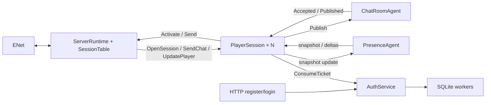

# Сервер: владельцы состояния и сетевой runtime

Сервер запускается через `Dreamsleeve.Server`: SQLite, HTTP(S) authentication,
ServerRuntime, PlayerSession для каждого соединения, ChatRoomAgent и PresenceAgent.
Общего прикладного маршрутизатора SessionRegistry больше нет.

## Владение

| Компонент | Ответственность |
|---|---|
| ServerRuntime | Единственный последовательный владелец транспорта, короткая диспетчеризация, жизненный цикл сессий и источников |
| SessionTable | Закрытые Dictionary маршрутов ConnectionId и резервов PlayerId внутри runtime; собственного агента нет |
| PlayerSession | Domain.Player, вход, начальные снимки, квота собственных RequestId, порядок исходящих сообщений |
| ChatRoomAgent | Членство конкретных соединений, авторство, ID/время сообщения, история и адресная рассылка |
| PresenceAgent | Онлайн, последние полные снимки игроков, объединение изменений и периодическая репликация |
| AuthService | Допуск account-операций и одноразовые билеты; bounded workers выполняют SQLite и проверку паролей |
| EnetTransport | Адаптер yENet в том же контуре владения, без второго глобального роутера |



Схема показывает основной поток данных; подписки и подтверждения очистки описаны ниже.

Агент выполняет один обработчик за раз; разные агенты могут работать параллельно
через ThreadPool. Выделенного потока на каждого игрока нет. Коллекции состояния
используются только обработчиком владельца. Адреса подписчиков не дают доступа
к изменяемому Player. Чат хранит профиль для авторства, Presence — самостоятельные
неизменяемые снимки; живой ActorValueStorage за пределы сессии не передаётся.

## Вход и личность

Каждое транспортное соединение получает новый Guid ConnectionId, независимо от
повторно используемого ENet peer slot. PlayerId обозначает постоянный профиль,
RequestId — запрос клиента. Вход подтверждается одноразовым билетом от AuthService.

HTTP register сохраняет учётную запись и профиль одной транзакцией. Login проверяет
хеш пароля и выдаёт случайный билет с ограниченным сроком жизни. PlayerSession
погашает его → резервирует PlayerId в runtime → подписывается на чат и онлайн →
собирает начальные снимки. Профиль берётся из результата аутентификации, а не
из имени, присланного клиентом. Повторный вход после перезапуска сохраняет
PlayerId, Username и DisplayName; старые билеты недействительны.

Оба источника формируют snapshot и подписку в одном обработчике. Их следующие
события идут после снимка через тот же последовательный путь. PlayerSession
собирает снимки, ограниченно буферизует дельты, затем отправляет единый порядок:
Activate(SessionOpened) → накопленные события → новые события.
Runtime проверяет актуальность резерва и дедлайн, ставит SessionOpened первым
и открывает вход обычных команд. До этого ENet Connected не означает Ready.

Онлайн и история больше не образуют одну глобальную транзакцию. Каждый источник
сохраняет собственный порядок; сообщение может прийти до PlayerJoined или после
PlayerLeft. Оно содержит профиль автора и корректно отображается независимо от
текущего онлайна. История также сохраняет сообщения уже вышедших игроков.

## Чат и состояние игрока

Путь публикации: `runtime → PlayerSession → ChatRoomAgent → PlayerSession получателя → runtime`.
Переход через персональный агент ограничивает незавершённые запросы отправителя;
общего словаря ожиданий публикаций нет. Перегрузка до передачи команды возвращает
Overloaded и не изменяет историю. Повтор уже ожидающего RequestId закрывает сессию:
отдельный отказ с тем же ID мог бы ошибочно завершить первоначальный запрос.

Канал принимает ConnectionId, RequestId, валидированный текст и адрес ответа.
Автор берётся из членства, ID и миллисекундное UTC-время создаёт сам канал.
MessageId возрастает внутри канала; идентичность сообщения — (ChannelId, MessageId).
Порядок задаёт ID, не часы. История ограничена HistoryCapacity; ReadHistory
возвращает типизированную страницу с курсором, HasGap и HasMore.

Автор получает Accepted с RequestId, остальные — Published без корреляции.
Оба результата кодируются одним wire ChatPublished; автору не отправляется
вторая копия. ReplyTo позволяет вернуть NotMember после удаления подписки.
Принятое сообщение сохраняется при отключении автора или неудаче доставки.
Повторы после сбоя не обеспечивают exactly-once и не выполняются автоматически.

В protocol v3 `UpdatePlayer` проходит через тот же персональный владелец. Команды
`BeginCharacter`, `RenameCharacter`, `Sample`, `SetDetails`, `LeaveGame` не содержат
PlayerId: профиль берётся из аутентифицированной сессии. Sample заменяет location
и всю `Map<ActorValueKey, ActorValueInfo>`; отсутствие location означает неизвестную
позицию, пустая карта удаляет прежние значения. При Rename/Sample нужен активный
персонаж. SetDetails допускает меню, загрузку и новую игру до его появления;
Race/Level без персонажа отклоняются. Лимиты применяются до изменения состояния.

BeginCharacter всегда начинает новое поколение, даже при совпадении имени.
Он и LeaveGame увеличивают CharacterGeneration, очищают location, actorvalues и
Details. Rename сохраняет поколение и остальные данные. Details содержит расу,
уровень, структурированную активность, подписи места и сообщённое клиентом время
начала игры; это наблюдения клиента, не результат серверной симуляции.

Сессия принимает команду только при свободном месте в ограниченном Presence outbox.
`PlayerUpdateAccepted` завершает запрос; состояние клиента и автора обновляется
после репликации тем же путём, что у остальных участников. Ошибка доставки в
закрытый Presence завершает владельца наблюдаемым образом, без вечного pending.
`PlayerSessionMessage.Read` возвращает собственный detached snapshot; отдельного
внутреннего потока мутаций для тестов нет.

Presence хранит Latest и Published на каждого игрока и множество dirty PlayerId.
Один ожидающий таймер запускается при первом изменении; повторные наблюдения до
flush заменяют Latest. При равных снимках пакет не отправляется. Если изменилась
только location, отправляется короткий `PlayerMoved`; изменения профиля, имени,
поколения, actorvalues или Details дают полный `PlayerUpdated`. Автор включён в
рассылку. Это объединение состояний, поэтому промежуточные позиции не гарантируются.

Перед snapshot нового подписчика Presence публикует накопленные изменения старым
подписчикам и выравнивает общий Published baseline. Иначе возврат состояния B→A
после входа с B мог бы оставить новичка без нужной дельты. Затем новый участник
получает полный Latest snapshot, а следующие события идут за ним. Join не создаёт
дополнительного таймера; Complete отсоединяет ожидающий таймер без ожидания интервала.
Detach удаляет membership и dirty, устаревший ConnectionId не обновляет заменившую
его сессию. Медленный адресат удаляется по прежней политике, остальные продолжают
получать Updated/Moved/Left в порядке источника.

## Очереди и перегрузка

AgentMailbox.boundedWithControl задаёт общий FIFO и предел обычных сообщений.
Служебные сообщения используют резерв без обгона уже принятых команд; текущий
обработчик не входит в ёмкость очереди. Классификатор чистый и применяется в
библиотеке к каждому пути допуска, включая Map и Ask.

| Граница | Ограничение и результат насыщения |
|---|---|
| Runtime → PlayerSession | Неблокирующий TryPost; отказ запроса либо закрытие соединения |
| Собственные публикации | MaxPendingChat на сессию; место освобождает Accepted/Rejected |
| Сессия → Presence | MaxPendingUpdates плюс 2 места Join/Detach; переполнение возвращает Overloaded до мутации |
| Исходящие команды сессии | Ограниченные ordered outbox; отдельное место для Join/Detach/Close |
| Чат/онлайн → подписчик | TryPost, без фонового ожидания каждого получателя |
| Bootstrap | MaxBootstrapEvents; переполнение закрывает открывающуюся сессию |
| Сессия → runtime | MaxPendingOutput и служебный запас в той же FIFO |
| Транспорт | Общие и персональные бюджеты пакетов/байтов плюс MaxPacketBytes/MaxWaitingData |

Full подписчика удаляет только его и посылает SlowConsumer runtime по отдельному
ограниченному служебному выходу. Остальные получают событие без ожидания этого
адресата. Closed также удаляет подписку. Presence публикует соответствующий Left.
Это явная политика отключения перегруженного потребителя, не молчаливое отбрасывание
reliable-данных при сохранении рабочей сессии.

Снимок отправляется первым. Detach подтверждается после удаления. Ответ cleanup
использует резерв получателя; если он всё-таки Full, источник отменяется и владелец
видит Completion. Переполнение управляющего outbox тоже прекращает источник.
Потерянный обязательный ответ не превращается в успешное продолжение работы.

AuthService ограничивает одновременные операции MaxConcurrentOperations и билеты
MaxTickets. Хеширование и синхронные SQLite-вызовы запускаются через
AgentReplyDispatcher.createAsyncHandler вне обработчика; завершение приходит
сообщением с OperationId. Место резервируется до начала работы и остаётся занятым
до доставки ответа. Отмена ожидания HTTP не откатывает уже принятую регистрацию.
MemoryProfileStore и прежний контракт профилей перенесены в tests/Fixtures; production их не содержит.

## Отключение, авария и остановка

Runtime сразу запрещает новые команды старого ConnectionId. Штатный Close
использует ENet DisconnectLater: уже принятые пакеты могут завершить отправку.
Резерв PlayerId и учёт соединения остаются до завершения старого игрока,
очистки членства и подтверждённого Disconnected. Штатный Stop сессии закрывает
обычный допуск и отправляет Detach после её прежних команд в том же ordered outbox.

После фактического Completion игрока runtime повторно отправляет идемпотентный
Detach в чат и онлайн. Это одновременно аварийный барьер: поздний Join из фоновой
отправки старого игрока уже не появится за очисткой. Резерв снимается только после
обоих подтверждений и освобождения транспорта. Старые Close/Detach не затрагивают
нового ConnectionId.

Context.Own отменяет собственных детей при аварии и ждёт их cleanup; Watch
наблюдает Completion AuthService без владения. Исходное необработанное исключение
видно через Completion. Ошибка одного игрока изолирована, потеря общей зависимости
останавливает runtime. Прозрачного перезапуска источников и восстановления истории нет.

OpenTimeoutMs ограничивает вход до принятого Activate. ShutdownTimeoutMs ограничивает
закрытие/общую остановку. Если domain cleanup готова, превышение deadline делает
Reset неответившего peer и завершает учёт соединения. Если старый владелец или его
членство ещё не очищены, runtime отменяет область обслуживания; резерв не снимается
поверх ещё работающей сессии.
Во время shutdown runtime продолжает читать служебные сообщения и отбрасывать
выход закрытых соединений. Источники завершаются после cleanup сессий, transport
освобождается после фактического Completion runtime.

После остановки HTTP и игрового runtime AuthService дожидается принятых workers.
Только затем закрываются зависимости и логирование. SQLite сохраняет профили;
онлайн, чат и билеты остаются в памяти. Hot reload и HTTP-админка не добавлены.

## Запуск и конфигурация

```powershell
dotnet run --project src/Dreamsleeve.Server -c Release
dotnet run --project src/Dreamsleeve.Server -c Release -- --write-config server.json
dotnet run --project src/Dreamsleeve.Server -c Release -- --config server.json --port 8778
xmake run Dreamsleeve.Client.Dev --connect 127.0.0.1 8778 player --register "Player Name"
```

По умолчанию ENet слушает 127.0.0.1:8778, auth HTTP — 127.0.0.1:8779.
Пароль вводится скрыто; после регистрации запускайте без --register. В сетевом Client.Dev доступны
`send <text>`, `read`, команды наблюдений персонажа, `disconnect`, `connect`, `quit`; сервер завершается по `quit`
или Ctrl+C. Для нескольких игроков запускаются несколько Client.Dev с разными именами.

JSON читается при запуске; можно переопределить часть секций Server/Runtime/Database/Authentication/Logging.
Неуказанные параметры сохраняют значения по умолчанию; неизвестные поля отклоняются.
`--port` имеет приоритет над файлом. ServerConfig проверяет согласованность transport
и codec, MaxSessions укладывается в PeerLimit/MaxInitialPlayers, история — в
MaxRecentMessages. `Server.PlayerInput` задаёт пределы строк игровых данных и
`MaxActorValues` (по умолчанию 64), `Runtime.Player.MaxPendingUpdates` — личный
выход в Presence (16), `Runtime.Presence.ReplicationIntervalMs` — интервал объединения
изменений (100 мс). Очереди и интервалы проверяются при запуске. Лимиты не согласуются
между клиентом и сервером по сети.

См. [схему протокола](../../../Protocol/README.ru.md),
[тесты](../../../tests/README.md), [план и расхождения](../../../docs/SessionArchitecturePlanRu.md).

См. [вход, хранение и зависимости](../../../docs/AuthenticationRu.md).

### Область доставки позиций

`PresenceOptions.VisibilityDistance` — конечный неотрицательный float32 в Skyrim units
(по умолчанию 8192). Расстояние считается в double внутри одинакового WRLD/CELL
по XYZ с включённой границей. Метаданные и онлайн глобальны, Location проецируется
для каждого получателя; self не фильтруется. Отсутствие собственной позиции
скрывает чужие позиции. Выход из области даёт Moved(None), вход — Moved(actual).
Та же проекция используется для Snapshot, Joined и Updated.

Published/Latest остаются единственными базовыми состояниями. При flush учитывается
движение источника и наблюдателя; общая предыдущая база меняется после всей пачки.
Отдельная таблица подписок на каждую пару игроков не нужна. Удалённый медленный
участник не может получить/породить последующий update из текущей пачки после Left.
Неизменившиеся скрытые позиции не создают пакетов. Память владельца остаётся O(N);
при движении всех вычисления O(N²), пространственного индекса пока нет.
