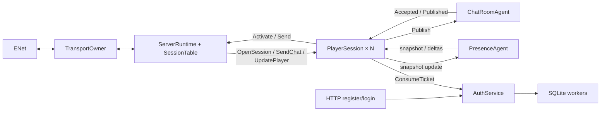

# Сервер: владельцы состояния и сетевой runtime

Сервер запускается через `Dreamsleeve.Server`: SQLite, HTTP(S) authentication, веб-админка,
ServerRuntime, PlayerSession для каждого соединения, ChatRoomAgent и PresenceAgent.
Общего прикладного маршрутизатора SessionRegistry больше нет.

## Владение

| Компонент | Ответственность |
|---|---|
| ServerRuntime | Короткая диспетчеризация managed-событий транспорта, жизненный цикл сессий и источников |
| SessionTable | Закрытые Dictionary маршрутов ConnectionId и резервов PlayerId внутри runtime; собственного агента нет |
| PlayerSession | Domain.Player, вход, начальные снимки, квота собственных RequestId, порядок исходящих сообщений |
| ChatRoomAgent | Членство конкретных соединений, авторство, ID/время сообщения, история и адресная рассылка |
| PresenceAgent | Онлайн, последние полные снимки игроков, объединение изменений и периодическая репликация |
| GroundMarksAgent | Все метки на земле, их пространственный индекс, видимые наборы наблюдателей, квоты, частота, срок жизни и запись в хранилище |
| AuthService | Допуск account-операций и одноразовые билеты с ролью игрока; bounded workers выполняют SQLite и проверку паролей |
| AdminService | Администраторы, сессии панели, токены API, роли, аудит, поиск игроков; одноразовые коды и попытки входа в памяти, bounded workers `admin-storage` |
| SessionDescriber | Ретранслятор запросов панели к сессиям: передаёт `ReplyChannel` вызывающего сессии, не дожидаясь ответа |
| EnetTransport | Адаптер yENet на отдельном TransportOwner, bounded handoff с runtime |



Схема показывает основной поток данных; подписки и подтверждения очистки описаны ниже.

Агент выполняет один обработчик за раз; разные агенты могут работать параллельно
через ThreadPool. Выделенного потока на каждого игрока нет. Коллекции состояния
используются только обработчиком владельца. Адреса подписчиков не дают доступа
к изменяемому Player. Чат хранит профиль для авторства, Presence — самостоятельные
неизменяемые снимки; живой ActorValueStorage за пределы сессии не передаётся.

## Вход и личность

Каждое транспортное соединение получает новый Guid ConnectionId, независимо от
повторно используемого ENet peer slot. PlayerId обозначает постоянный профиль,
RequestId — запрос клиента. Вход подтверждается одноразовым билетом от AuthService.

HTTP register сохраняет учётную запись и профиль одной транзакцией. Login проверяет
хеш пароля и выдаёт случайный билет с ограниченным сроком жизни. PlayerSession
погашает его → резервирует PlayerId в runtime → подписывается на чат и онлайн →
собирает начальные снимки. Профиль берётся из результата аутентификации, а не
из имени, присланного клиентом. Повторный вход после перезапуска сохраняет
PlayerId, Username и DisplayName; старые билеты недействительны.

Оба источника формируют snapshot и подписку в одном обработчике. Их следующие
события идут после снимка через тот же последовательный путь. PlayerSession
собирает снимки, ограниченно буферизует дельты, затем отправляет единый порядок:
Activate(SessionOpened) → накопленные события → новые события.
Runtime проверяет актуальность резерва и дедлайн, ставит SessionOpened первым
и открывает вход обычных команд. До этого ENet Connected не означает Ready.

### Скрытое имя

`SessionOpenRequest.Hiding` (`HiddenIdentity`: `Shown` / `Everywhere` / `ExceptGroundMarks`)
приходит из `OpenSession.hidden_identity`. Если
`[Identity] AllowHiddenIdentity = false`, сессия отказывает с `HIDDEN_IDENTITY_NOT_ALLOWED` ещё
до погашения билета. Иначе `SessionHostCommand.Reserve` несёт модерированный профиль и выбор:
runtime в том же обработчике резервирует PlayerId и регистрирует имена в `PseudonymBook`
(`SessionTable.Names`, `PseudonymBook.apply`) — показанный профиль или псевдоним — и отвечает
`IdentityAdmission.Reserved(pseudonym)`. Книга освобождается вместе с резервом PlayerId.

Единственная точка подмены — `publicSnapshot`/`publicIdentity`/`publicCharacterName` сессии:
снимок и обновления присутствия, `ChatSubmission.Author` (чат и объявления) и
`GroundMarkSubmission.Pseudonym` (только при `Everywhere`; при `ExceptGroundMarks` метка несёт
настоящий профиль и имя персонажа) уже содержат псевдоним, поэтому ChatRoomAgent, PresenceAgent
и GroundMarksAgent никогда не получают настоящих имён скрытого игрока. ChatRoomAgent берёт
автора из заявки и закрывает соединение, если его PlayerId не совпадает с подпиской.
GroundMarksAgent хранит у метки её псевдоним (`GroundMark.Pseudonym`, SQLite
`author_pseudonym`) и собирает автора для wire через `GroundMark.authorIdentity`; словарь
`Authors` содержит только настоящие модерированные профили. Свою запись сессия
восстанавливает в приветствии и в `PlayerUpdated` (`ownView`), а `SessionWelcome.OwnPseudonym`
сообщает владельцу его псевдоним; кодек отвергает приветствие с псевдонимной записью получателя.

`SetIdentityVisibility(hiding)` в Active: совпадение с текущим вариантом подтверждается сразу;
второе переключение, пока первое ждёт runtime, — `OVERLOADED`; чаще `ToggleIntervalMs` —
`RATE_LIMITED`; иначе `SessionHostCommand.ChangeIdentity` → runtime выбирает новый псевдоним
(при переходе из `Shown`), оставляет прежний (`Everywhere` ↔ `ExceptGroundMarks`) или снова
показывает профиль → `IdentityChanged` → сессия меняет состояние, отправляет
`PresenceCommand.Update` (два запасных слота исходящей очереди присутствия) и отвечает
`IdentityVisibilityChanged`. Заявки, отправленные до ответа, уходят со старой личностью.
Лимит частоты — на сессию: переподключение его сбрасывает, но и выдаёт новый псевдоним.

Онлайн и история больше не образуют одну глобальную транзакцию. Каждый источник
сохраняет собственный порядок; сообщение может прийти до PlayerJoined или после
PlayerLeft. Оно содержит профиль автора и корректно отображается независимо от
текущего онлайна. История также сохраняет сообщения уже вышедших игроков.

## Чат и состояние игрока

PlayerSession проверяет текст по словарю (`ModerationRules`, передаётся в
`ServerRuntime.start`) до передачи в канал и публикует профиль и имя персонажа только
в модерированном виде. ChatRoomAgent ограничивает частоту, всплеск и повторы по
стабильному PlayerId (`Runtime.Chat.RateBurst/RateRefillMs/DuplicateWindowMs`) и
отклоняет лишнее до `Chat.append`. См. [модерация и имена](../../docs/ModerationAndNamesRu.md).

Путь публикации: `runtime → PlayerSession → ChatRoomAgent → PlayerSession получателя → runtime`.
Переход через персональный агент ограничивает незавершённые запросы отправителя;
общего словаря ожиданий публикаций нет. Перегрузка до передачи команды возвращает
Overloaded и не изменяет историю. Повтор уже ожидающего RequestId закрывает сессию:
отдельный отказ с тем же ID мог бы ошибочно завершить первоначальный запрос.

Канал принимает ConnectionId, RequestId, валидированный текст и адрес ответа.
Автор берётся из членства, ID и миллисекундное UTC-время создаёт сам канал.
MessageId возрастает внутри канала; идентичность сообщения — (ChannelId, MessageId).
Порядок задаёт ID, не часы. История ограничена HistoryCapacity; ReadHistory
возвращает типизированную страницу с курсором, HasGap и HasMore.

Автор получает Accepted с RequestId, остальные — Published без корреляции.
Оба результата кодируются одним wire ChatPublished; автору не отправляется
вторая копия. ReplyTo позволяет вернуть NotMember после удаления подписки.
Принятое сообщение сохраняется при отключении автора или неудаче доставки.
Повторы после сбоя не обеспечивают exactly-once и не выполняются автоматически.

С protocol v6 `UpdatePlayer` проходит через тот же персональный владелец. Команды
`BeginCharacter`, `RenameCharacter`, `SetLocation`, `SetActorValues`, `SetDetails`, `LeaveGame` не содержат
PlayerId: профиль берётся из аутентифицированной сессии. SetLocation задаёт reliable-контекст location, SetActorValues — только всю карту показаний; отсутствие location означает неизвестную
позицию, пустая карта удаляет прежние значения. При Rename/SetLocation/SetActorValues нужен активный
персонаж. SetDetails допускает меню, загрузку и новую игру до его появления;
Race/Level без персонажа отклоняются. Лимиты применяются до изменения состояния.

BeginCharacter всегда начинает новое поколение, даже при совпадении имени.
Он и LeaveGame увеличивают CharacterGeneration, очищают location, actorvalues и
Details. Rename сохраняет поколение и остальные данные. Details содержит расу,
уровень, структурированную активность, подписи места и сообщённое клиентом время
начала игры; это наблюдения клиента, не результат серверной симуляции.

Сессия принимает команду только при свободном месте в ограниченном Presence outbox.
`PlayerUpdateAccepted` завершает запрос; состояние клиента и автора обновляется
после репликации тем же путём, что у остальных участников. Ошибка доставки в
закрытый Presence завершает владельца наблюдаемым образом, без вечного pending.
`PlayerSessionMessage.Read` возвращает собственный detached snapshot; отдельного
внутреннего потока мутаций для тестов нет.

Движение идёт отдельным `MovementSample`: context revision, sequence и абсолютная
поза. Сессия принимает только новый sequence в текущем контексте; RequestId,
ожидание ACK и индивидуальные ответы для этих samples отсутствуют. Клиент
периодически повторяет последнюю позу, в том числе после остановки.

Presence хранит последнее состояние и один пространственный индекс. На каждом
периоде публикует все актуальные видимые позы, даже без изменений. Reliable
`PlayerVisibilityChanged` устанавливает/очищает координатный baseline с новым
view revision; realtime не может сам создать видимость. Metadata публикуется
по dirty-набору и не сбрасывает позу того же поколения персонажа.

Join получает согласованный snapshot, дальнейшие изменения идут за ним по
порядку владельца. Переполнение realtime допускает пропуск периода, reliable
по-прежнему требует явного отказа/закрытия. Runtime кодирует готовые пачки сразу,
без второго словаря движения и flush-барьеров перед другими ответами.

### Объявления

Системный канал ([DomainSpecRu.MD §4.8](../../docs/DomainSpecRu.MD)) — второй
ChatRoomAgent (`ChatChannelKind.System`, ChannelId 2) рядом с общим (`Global`, 1): своя
история (`[Announcements] HistoryCapacity`), своя последовательность MessageId и свой
лимит частоты (`AnnouncementOptions.channelOptions`). Правило вида — в домене
(`Chat.append`): системный канал принимает только объявления, общий — только чат.
PlayerSession подписывается на оба, открывается после обоих снимков и отключается от
обоих; SessionTable ждёт `SystemDetached` так же, как `ChatDetached`.

- Серверные объявления: `ChatRoomCommand.Announce` без запроса и ответа, без автора
  (`ChatMessage.serverAnnouncement`), членство не требуется. Источники — расписание `[[Announcements.Scheduled]]` (AnnouncementSchedule на тике
  ServerRuntime: разовые снимаются, периодические после простоя публикуются один раз, без
  догоняния) и консольная команда `announce <текст>` (вид `Admin`,
  `ServerRuntimeMessage.Announce`). Полный mailbox канала отбрасывает объявление с
  предупреждением в логе, не останавливая runtime.
- Клиентские: `PostAnnouncement{channel_id}` на Chat-канале ENet. Codec отклоняет
  серверные виды (правило домена `Announcement.clientMayRequest`), неизвестные значения,
  отсутствующую подпись `ThirdParty` и длину (`AnnouncementText.create`,
  `ChatInput.AnnouncementText` = 500, `AnnouncementSignature` = 64); runtime отвечает
  `INVALID_REQUEST` с полем `text`/`source`. PlayerSession направляет запрос по виду
  канала (не системный — `INVALID_REQUEST` с полем `channel_id`), применяет `AnnouncementOptions.admit` (единая точка
  будущих правил допуска источника; сейчас — `Enabled` источника, иначе
  `ANNOUNCEMENT_NOT_ALLOWED`), словарь к тексту и подписи и передаёт `ChatSubmission` с
  `Announcement` системному каналу; подтверждение — тем же `ChatAccepted`. `SendChat` в
  системный канал получает `INVALID_REQUEST`. Владелец канала заново вид не проверяет:
  это инвариант `Chat.append`, и нарушение останавливает владельца.
- Лимиты истории и частоты системного канала проверяет `ChatRoomAgent.start`, расписание —
  `AnnouncementOptions.resolve` при старте runtime; конфигурация их не дублирует.
- Приветствие несёт каналы с видом и хвостом и `AnnouncementPolicy` (разрешённые
  источники и лимиты).
- Имена `server` и `system` зарезервированы при регистрации (`Moderation.reservedUsername`).

### Метки на земле

`GroundMarksAgent` — один владелец меток ([DomainSpecRu.MD §4.9](../../docs/DomainSpecRu.MD),
[GroundMarksRu.md](../../docs/GroundMarksRu.md)): `GroundMarkStorage`, индекс
`SpatialIndex<GroundMarkId>` (ячейка — `GroundMarks.VisibilityDistance`), снимки профилей
авторов и на каждого наблюдателя — набор видимых id и `ViewRevision`. PlayerSession
подписывается при входе (`Join`), при `SetLocation`/`BeginCharacter`/`LeaveGame` и каждом
принятом sample сообщает положение (`Observe`; потеря сообщения допустима — владелец
сравнивает с последним известным состоянием), отписывается при остановке (`Detach`).
Runtime после завершения сессии шлёт `Detach` и меткам; `SessionTable` ждёт
`GroundMarksDetached`, как `PresenceDetached`, поэтому `Runtime.ControlReserve` ≥
`4 * MaxSessions + 4`. Второе соединение живого аккаунта закрывается
(`ground_marks_identity_conflict`).

Размещение: `PlayerSession` проверяет RequestId и лимит ожидающих (общий с чатом),
положение (`GroundMarkPlacement.isNear`, `INVALID_REQUEST`/`placement`) и словарь
(`TEXT_NOT_ALLOWED`, флаги), затем `GroundMarkCommand.Place`; владелец — частоту
(`RateLimit` для надписей, интервал для смертей → `RATE_LIMITED`), плотность ячейки
(`GROUND_MARK_AREA_FULL`), квоту с вытеснением, выдаёт id, пишет `Insert`/`Delete` и
отвечает `Placed` (id вытесненной); наблюдатели, включая автора, получают дельту.
`Remove` — только своя метка (`GROUND_MARK_NOT_FOUND`). Дельты (`Changed`):
при смене ячейки — добавлены/удалены, при смене пространства/поколения или потере
позиции — `clear` и baseline; пустой baseline не отправляется. Истёкшие метки снимает
тикер `ExpiryCheckIntervalMs` и первый шаг после старта.

Хранение: `SqliteGroundMarkStore` (Infrastructure, SqlHydra на общем контексте с аккаунтами) — `loadAll` при старте (метки с
профилями авторов, снимком имени персонажа и high-water mark id), `startWriter` — последовательный агент
`GroundMarkWrite`; владелец отдаёт записи через `AgentOutbox(MaxPendingWrites)`,
переполнение останавливает его. Ошибка отдельной записи логируется. Запуск: Program
загружает метки, не передаёт владельцу запрещённые словарём (в БД они остаются), пересчитывает флаги и передаёт
`GroundMarkPersistence` в `ServerRuntime.start`; писатель завершается после runtime.
Общий модуль `RateLimit` обслуживает и каналы чата, и надписи.

### Админка

Веб-панель ([docs/AdminPanelRu.md](../../docs/AdminPanelRu.md)) обращается к runtime только
сообщениями; своих правил у неё нет.

- `ServerRuntimeMessage.ListSessions` отвечает строками `RuntimeSessionRow` (ConnectionId,
  PlayerId, фаза `Waiting/Opening/Ready/Closing`, время подключения, адрес сессии) — без имён.
- `PlayerSessionMessage.Describe` отвечает `AdminPlayerView` из состояния сессии (хранимый
  профиль до заместителей модерации, имя персонажа, псевдоним и вариант, роль, место) или
  `None` до получения профиля. HTTP-обработчик спрашивает все сессии параллельно через
  `SessionDescriber` с таймаутом 1 с; неответившая строка остаётся «без данных». `Describe`
  — обычное сообщение: переполненная сессия не отвечает, но и не закрывается.
- Роль: `SessionAuthenticationReply` несёт `AuthenticatedPlayer { Profile; Role }` (роль читается
  из `player_roles` при входе и resume и хранится в билете). `SetPlayerRole(playerId, role)` —
  после записи в БД: runtime запоминает её в `SessionTable.Roles` и передаёт
  `PlayerSessionMessage.RoleChanged` сессии, держащей резерв PlayerId; сессия, резервирующая
  PlayerId позже, получает её сразу после `IdentityAdmission.Reserved` в своей FIFO.
- Переименование: `AuthService.RenamePlayer` пишет БД, затем `RenamePlayer(profile)` —
  `SessionTable.Profiles` и `ProfileChanged(stored)` сессии. Сессия применяет
  `Moderation.publicProfile`, отправляет `SessionHostCommand.UpdateProfile` (runtime обновляет
  книгу имён, сохраняя псевдоним) и `PresenceCommand.Update`; `identityEqual` превращает смену в
  `PlayerUpdated`. У скрытого игрока публичная личность не меняется, новое имя никуда не уходит.
  Новые сообщения чата несут новое имя; `GroundMarksAgent` берёт профиль автора из подписки,
  поэтому метки без псевдонима покажут его после переподключения.
- `RoleChanged`/`ProfileChanged` — служебные сообщения сессии (резерв mailbox);
  `ListSessions`/`SetPlayerRole`/`RenamePlayer` — обычные сообщения runtime.
- Объявление панели — тот же `ServerRuntimeMessage.Announce`, что у консоли.

## Очереди и перегрузка

AgentMailbox.boundedWithControl задаёт общий FIFO и предел обычных сообщений.
Служебные сообщения используют резерв без обгона уже принятых команд; текущий
обработчик не входит в ёмкость очереди. Классификатор чистый и применяется в
библиотеке к каждому пути допуска, включая Map и Ask.

| Граница | Ограничение и результат насыщения |
|---|---|
| Runtime → PlayerSession | Неблокирующий TryPost; отказ запроса либо закрытие соединения |
| Собственные публикации | MaxPendingChat на сессию; место освобождает Accepted/Rejected |
| Сессия → Presence | MaxPendingUpdates плюс 2 места Join/Detach; переполнение возвращает Overloaded до мутации |
| Исходящие команды сессии | Ограниченные ordered outbox; отдельное место для Join/Detach/Close |
| Чат/онлайн → подписчик | TryPost, без фонового ожидания каждого получателя |
| Bootstrap | MaxBootstrapEvents; переполнение закрывает открывающуюся сессию |
| Сессия → runtime | MaxPendingOutput и служебный запас в той же FIFO |
| Транспорт | Общие и персональные бюджеты пакетов/байтов плюс MaxPacketBytes/MaxWaitingData |

Full при reliable-событии удаляет только подписчика и посылает SlowConsumer runtime по отдельному
ограниченному служебному выходу. Остальные получают событие без ожидания этого
адресата. Closed также удаляет подписку. Presence публикует соответствующий Left.
Это явная политика отключения перегруженного потребителя, не молчаливое отбрасывание
reliable-данных при сохранении рабочей сессии.

Снимок отправляется первым. Detach подтверждается после удаления. Ответ cleanup
использует резерв получателя; если он всё-таки Full, источник отменяется и владелец
видит Completion. Переполнение управляющего outbox тоже прекращает источник.
Потерянный обязательный ответ не превращается в успешное продолжение работы.

AuthService ограничивает одновременные операции MaxConcurrentOperations и билеты
MaxTickets. Хеширование и синхронные SQLite-вызовы запускаются через
AgentReplyDispatcher.createAsyncHandler вне обработчика; завершение приходит
сообщением с OperationId. Место резервируется до начала работы и остаётся занятым
до доставки ответа. Отмена ожидания HTTP не откатывает уже принятую регистрацию.
MemoryProfileStore и прежний контракт профилей перенесены в tests/Fixtures; production их не содержит.

## Отключение, авария и остановка

Runtime сразу запрещает новые команды старого ConnectionId. Штатный Close
использует ENet DisconnectLater: уже принятые пакеты могут завершить отправку.
Резерв PlayerId и учёт соединения остаются до завершения старого игрока,
очистки членства и подтверждённого Disconnected. Штатный Stop сессии закрывает
обычный допуск и отправляет Detach после её прежних команд в том же ordered outbox.

После фактического Completion игрока runtime повторно отправляет идемпотентный
Detach в чат и онлайн. Это одновременно аварийный барьер: поздний Join из фоновой
отправки старого игрока уже не появится за очисткой. Резерв снимается только после
обоих подтверждений и освобождения транспорта. Старые Close/Detach не затрагивают
нового ConnectionId.

Context.Own отменяет собственных детей при аварии и ждёт их cleanup; Watch
наблюдает Completion AuthService без владения. Исходное необработанное исключение
видно через Completion. Ошибка одного игрока изолирована, потеря общей зависимости
останавливает runtime. Прозрачного перезапуска источников и восстановления истории нет.

OpenTimeoutMs ограничивает вход до принятого Activate. ShutdownTimeoutMs ограничивает
закрытие/общую остановку. Если domain cleanup готова, превышение deadline делает
Reset неответившего peer и завершает учёт соединения. Если старый владелец или его
членство ещё не очищены, runtime отменяет область обслуживания; резерв не снимается
поверх ещё работающей сессии.
Во время shutdown runtime продолжает читать служебные сообщения и отбрасывать
выход закрытых соединений. Источники завершаются после cleanup сессий, transport
освобождается после фактического Completion runtime.

После остановки HTTP и игрового runtime AuthService дожидается принятых workers.
Только затем закрываются зависимости и логирование. SQLite сохраняет профили;
онлайн, чат и билеты остаются в памяти. Hot reload и HTTP-админка не добавлены.

## Запуск и конфигурация

```powershell
dotnet run --project src/Dreamsleeve.Server -c Release
dotnet run --project src/Dreamsleeve.Server -c Release -- --write-config server.toml
dotnet run --project src/Dreamsleeve.Server -c Release -- --config server.toml --port 8778
xmake run Dreamsleeve.Client.Dev --connect 127.0.0.1 8778 player --register "Player Name"   # --hide: скрытое имя с первого пакета
```

По умолчанию ENet слушает 127.0.0.1:8778, auth HTTP — 127.0.0.1:8779, веб-админка — 127.0.0.1:8780
(`[Admin]`; HTTP-код обоих хостов — в `Dreamsleeve.Server.Web`). Консоль сервера также принимает
`admin-setup` и `admin-reset <имя>` (одноразовые коды панели печатаются только в консоль).
Пароль вводится скрыто; после регистрации запускайте без --register. В сетевом Client.Dev доступны
`send <text>`, `announce <trusted|third> <kind> <signature|-> <text>`, `hide <on|off>`, `read`, команды наблюдений персонажа,
`disconnect`, `connect`, `quit`; сервер завершается по `quit` или Ctrl+C, `announce <текст>` в его консоли публикует
объявление администратора. Для нескольких игроков запускаются несколько Client.Dev с разными именами.

TOML читается при запуске; можно переопределить часть секций Server/Runtime/Database/Authentication/Admin/Logging/Moderation/Identity/Announcements/GroundMarks.
Горячей перезагрузки нет ни у `server.toml`, ни у `moderation.toml`, ни у `pseudonyms.toml`: изменения, включая `[Announcements]`, действуют после перезапуска.
`[Identity]`: `AllowHiddenIdentity` (true), `ToggleIntervalMs` (30000, 0 — без лимита), `PseudonymsPath`
(`pseudonyms.toml`; отсутствующий или повреждённый файл — встроенные 24 имени с предупреждением).
Массивы таблиц поддержаны только для `[[Announcements.Scheduled]]`; каждая запись начинается со значений по умолчанию.
Неуказанные параметры сохраняют значения по умолчанию; неизвестные поля отклоняются.
`--port` имеет приоритет над файлом. ServerConfig проверяет согласованность transport
и codec, MaxSessions укладывается в PeerLimit/MaxInitialPlayers, история — в
MaxRecentMessages. `Server.PlayerInput` задаёт пределы строк игровых данных и
`MaxActorValues` (по умолчанию 64), `Runtime.Player.MaxPendingUpdates` — личный
выход в Presence (16), `Runtime.Presence.ReplicationIntervalMs` — интервал объединения
изменений (50 мс, 20 Гц). Очереди и интервалы проверяются при запуске. Лимиты не согласуются
между клиентом и сервером по сети.

См. [схему протокола](../../../Protocol/README.ru.md),
[тесты](../../../tests/README.md), [план и расхождения](../../../docs/SessionArchitecturePlanRu.md).

См. [вход, хранение и зависимости](../../../docs/AuthenticationRu.md).

### Область доставки позиций

`PresenceOptions.VisibilityDistance` — конечный неотрицательный float32 в Skyrim units
(по умолчанию 8192). Расстояние считается в double внутри одинакового WRLD/CELL
по XYZ с включённой границей. Метаданные и онлайн глобальны, Location проецируется
для каждого получателя; self не фильтруется. Отсутствие собственной позиции
скрывает чужие позиции. Выход из области даёт reliable clear, вход — reliable baseline.
Та же проекция используется для Snapshot и Joined; Updated несёт metadata.

Presence хранит view revision только для текущих видимых пар; при выходе запись
удаляется, при повторном входе выдаётся новый revision. Пространственный индекс
ограничивает кандидатов соседними ячейками. Память составляет O(N + число видимых
пар), плотная группа всё ещё требует O(N²) данных и работы.

ProtocolCodec классифицирует Control/Chat/Realtime и вызывает внутренние
ChatCodec/PlayerCodec/SessionCodec. [Контракт репликации](../../docs/SpatialReplicationRu.md).

TransportOwner непрерывно обслуживает ENet на одном потоке и уведомляет runtime
о готовых событиях. Период runtime обслуживает deadlines и резервный drain,
а ReplicationIntervalMs ограничивает только публикацию Presence.
`Server.Worker` задаёт пределы handoff по count/bytes, прохода отправки по
count/bytes/time и короткий прерываемый idle wait. Эти пределы не ограничивают
длительность одного внутреннего вызова ENet Service. `ServiceTimeoutMs` равен 0.

Массивы MovementChange и byte buffers после передачи владельцу не изменяются.
Очереди транспорта и внутренние бюджеты пакетов ENet ограничиваются отдельно.

`MaxOutgoingPacketsPerPeer` / `MaxOutgoingBytesPerPeer` также ограничивают
handoff одного peer в каждом направлении. Для realtime доступна только часть
общей и персональной ёмкости: небольшой запас остаётся reliable-данным. Это
не неограниченная гарантия при reliable-перегрузке; её отказ остаётся явным.
Служебные Close/Reset и события lifecycle имеют отдельный резерв.
