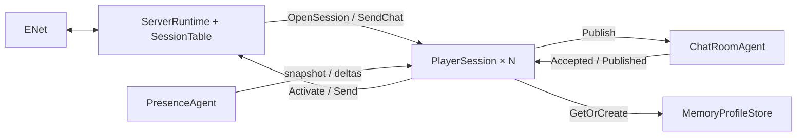

# Сервер: владельцы состояния и сетевой runtime

Сервер запускается через `Dreamsleeve.Server`: профильное хранилище в памяти,
ServerRuntime, PlayerSession для каждого соединения, ChatRoomAgent и PresenceAgent.
Общего прикладного маршрутизатора SessionRegistry больше нет.

## Владение

| Компонент | Ответственность |
|---|---|
| ServerRuntime | Единственный последовательный владелец транспорта, короткая диспетчеризация, жизненный цикл сессий и источников |
| SessionTable | Закрытые Dictionary маршрутов ConnectionId и резервов PlayerId внутри runtime; собственного агента нет |
| PlayerSession | Domain.Player, вход, начальные снимки, квота собственных RequestId, порядок исходящих сообщений |
| ChatRoomAgent | Членство конкретных соединений, авторство, ID/время сообщения, история и адресная рассылка |
| PresenceAgent | Онлайн, начальный снимок и последующие Joined/Left |
| MemoryProfileStore | Профили и выделение PlayerId, отдельный владелец в Infrastructure |
| EnetTransport | Адаптер yENet в том же контуре владения, без второго глобального роутера |



Схема показывает основной поток данных; подписки и подтверждения очистки описаны ниже.

Агент выполняет один обработчик за раз; разные агенты могут работать параллельно
через ThreadPool. Выделенного потока на каждого игрока нет. Коллекции состояния
используются только обработчиком владельца. Адреса подписчиков не дают доступа
к изменяемому Player; в них хранится неизменяемый профиль.

## Вход и личность

Каждое транспортное соединение получает новый Guid ConnectionId, независимо от
повторно используемого ENet peer slot. PlayerId обозначает постоянный профиль,
RequestId — запрос клиента. Dev-вход по имени не является аутентификацией.

PlayerSession проходит получение профиля → резервирование PlayerId в runtime →
подписку на чат и онлайн → сбор начальных снимков. MemoryProfileStore.GetOrCreate
атомарно возвращает существующий профиль или создаёт новый. Повторный вход
сохраняет PlayerId и DisplayName. FindByUsername/Create остаются отдельными
операциями хранилища; их не требуется согласовывать в автомате входа.

Оба источника формируют snapshot и подписку в одном обработчике. Их следующие
события идут после снимка через тот же последовательный путь. PlayerSession
собирает снимки, ограниченно буферизует дельты, затем отправляет единый порядок:
Activate(SessionOpened) → накопленные события → новые события.
Runtime проверяет актуальность резерва и дедлайн, ставит SessionOpened первым
и открывает вход обычных команд. До этого ENet Connected не означает Ready.

Онлайн и история больше не образуют одну глобальную транзакцию. Каждый источник
сохраняет собственный порядок; сообщение может прийти до PlayerJoined или после
PlayerLeft. Оно содержит профиль автора и корректно отображается независимо от
текущего онлайна. История также сохраняет сообщения уже вышедших игроков.

## Чат и состояние игрока

Путь публикации: `runtime → PlayerSession → ChatRoomAgent → PlayerSession получателя → runtime`.
Переход через персональный агент ограничивает незавершённые запросы отправителя;
общего словаря ожиданий публикаций нет. Перегрузка до передачи команды возвращает
Overloaded и не изменяет историю. Повтор уже ожидающего RequestId закрывает сессию:
отдельный отказ с тем же ID мог бы ошибочно завершить первоначальный запрос.

Канал принимает ConnectionId, RequestId, валидированный текст и адрес ответа.
Автор берётся из членства, ID и миллисекундное UTC-время создаёт сам канал.
MessageId возрастает внутри канала; идентичность сообщения — (ChannelId, MessageId).
Порядок задаёт ID, не часы. История ограничена HistoryCapacity; ReadHistory
возвращает типизированную страницу с курсором, HasGap и HasMore.

Автор получает Accepted с RequestId, остальные — Published без корреляции.
Оба результата кодируются одним wire ChatPublished; автору не отправляется
вторая копия. ReplyTo позволяет вернуть NotMember после удаления подписки.
Принятое сообщение сохраняется при отключении автора или неудаче доставки.
Повторы после сбоя не обеспечивают exactly-once и не выполняются автоматически.

PlayerUpdate и PlayerSessionMessage.Read работают непосредственно с персональным
владельцем. Снимок самостоятельный; смена персонажа/выход очищают игровые данные.
Wire-контракт игровых показаний пока не подключён.

## Очереди и перегрузка

AgentMailbox.boundedWithControl задаёт общий FIFO и предел обычных сообщений.
Служебные сообщения используют резерв без обгона уже принятых команд; текущий
обработчик не входит в ёмкость очереди. Классификатор чистый и применяется в
библиотеке к каждому пути допуска, включая Map и Ask.

| Граница | Ограничение и результат насыщения |
|---|---|
| Runtime → PlayerSession | Неблокирующий TryPost; отказ запроса либо закрытие соединения |
| Собственные публикации | MaxPendingChat на сессию; место освобождает Accepted/Rejected |
| Исходящие команды сессии | Ограниченные ordered outbox; отдельное место для Join/Detach/Close |
| Чат/онлайн → подписчик | TryPost, без фонового ожидания каждого получателя |
| Bootstrap | MaxBootstrapEvents; переполнение закрывает открывающуюся сессию |
| Сессия → runtime | MaxPendingOutput и служебный запас в той же FIFO |
| Транспорт | Общие и персональные бюджеты пакетов/байтов плюс MaxPacketBytes/MaxWaitingData |

Full подписчика удаляет только его и посылает SlowConsumer runtime по отдельному
ограниченному служебному выходу. Остальные получают событие без ожидания этого
адресата. Closed также удаляет подписку. Presence публикует соответствующий Left.
Это явная политика отключения перегруженного потребителя, не молчаливое отбрасывание
reliable-данных при сохранении рабочей сессии.

Снимок отправляется первым. Detach подтверждается после удаления. Ответ cleanup
использует резерв получателя; если он всё-таки Full, источник отменяется и владелец
видит Completion. Переполнение управляющего outbox тоже прекращает источник.
Потерянный обязательный ответ не превращается в успешное продолжение работы.

Хранилище профилей отдельно использует AgentReplyDispatcher: место под ответ
резервируется до изменения словаря, затем ответы разным получателям доставляются
независимо. При исчерпании MaxPendingReplies новые операции ждут; порядок ответов
не гарантирован, поэтому используется OperationId. Отмена ожидания ответа
не откатывает уже созданный профиль. Настоящий DB adapter пока не реализован.

## Отключение, авария и остановка

Runtime сразу запрещает новые команды старого ConnectionId. Штатный Close
использует ENet DisconnectLater: уже принятые пакеты могут завершить отправку.
Резерв PlayerId и учёт соединения остаются до завершения старого игрока,
очистки членства и подтверждённого Disconnected. Штатный Stop сессии закрывает
обычный допуск и отправляет Detach после её прежних команд в том же ordered outbox.

После фактического Completion игрока runtime повторно отправляет идемпотентный
Detach в чат и онлайн. Это одновременно аварийный барьер: поздний Join из фоновой
отправки старого игрока уже не появится за очисткой. Резерв снимается только после
обоих подтверждений и освобождения транспорта. Старые Close/Detach не затрагивают
нового ConnectionId.

Context.Own отменяет собственных детей при аварии и ждёт их cleanup; Watch
наблюдает общий profile store без владения. Исходное необработанное исключение
видно через Completion. Ошибка одного игрока изолирована, потеря общей зависимости
останавливает runtime. Прозрачного перезапуска источников и восстановления истории нет.

OpenTimeoutMs ограничивает вход до принятого Activate. ShutdownTimeoutMs ограничивает
закрытие/общую остановку. Если domain cleanup готова, превышение deadline делает
Reset неответившего peer и завершает учёт соединения. Если старый владелец или его
членство ещё не очищены, runtime отменяет область обслуживания; резерв не снимается
поверх ещё работающей сессии.
Во время shutdown runtime продолжает читать служебные сообщения и отбрасывать
выход закрытых соединений. Источники завершаются после cleanup сессий, transport
освобождается после фактического Completion runtime.

Хранилище можно оставить живым между перезапусками сети. Перезапуск самого
MemoryProfileStore или процесса теряет профили и начинает выдачу ID заново.
Долговременная БД, авторизация, hot reload конфигурации и HTTP-управление ещё не добавлены.

## Запуск и конфигурация

```powershell
dotnet run --project src/Dreamsleeve.Server -c Release
dotnet run --project src/Dreamsleeve.Server -c Release -- --write-config server.json
dotnet run --project src/Dreamsleeve.Server -c Release -- --config server.json --port 8778
xmake run Dreamsleeve.Client.Dev --connect 127.0.0.1 8778 player "Player Name"
```

По умолчанию сервер слушает 127.0.0.1:8778. В сетевом Client.Dev доступны
`send <text>`, `read`, `disconnect`, `connect`, `quit`; сервер завершается по `quit`
или Ctrl+C. Для нескольких игроков запускаются несколько Client.Dev с разными именами.

JSON читается при запуске; можно переопределить часть секций Server/Runtime/Profiles.
Неуказанные параметры сохраняют значения по умолчанию; неизвестные поля отклоняются.
`--port` имеет приоритет над файлом. ServerConfig проверяет согласованность transport
и codec, MaxSessions укладывается в PeerLimit/MaxInitialPlayers, история — в
MaxRecentMessages. Лимиты не согласуются между клиентом и сервером по сети.

См. [схему протокола](../../../Protocol/README.ru.md),
[тесты](../../../tests/README.md), [план и расхождения](../../../docs/SessionArchitecturePlanRu.md).
